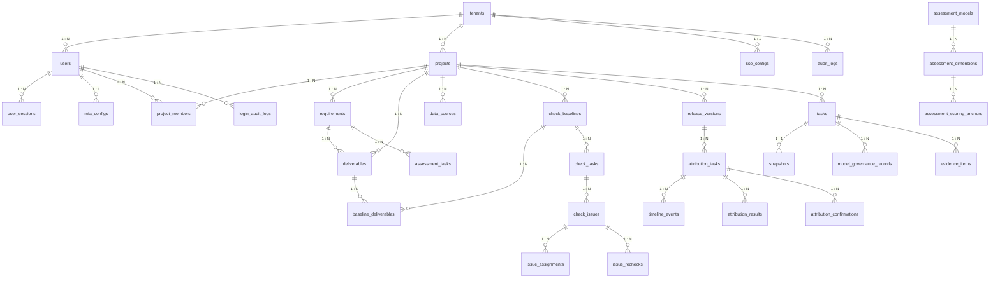
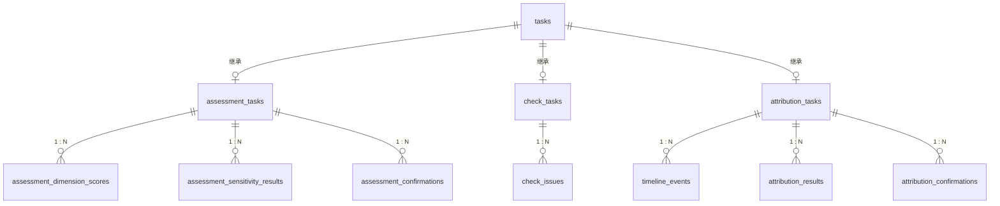
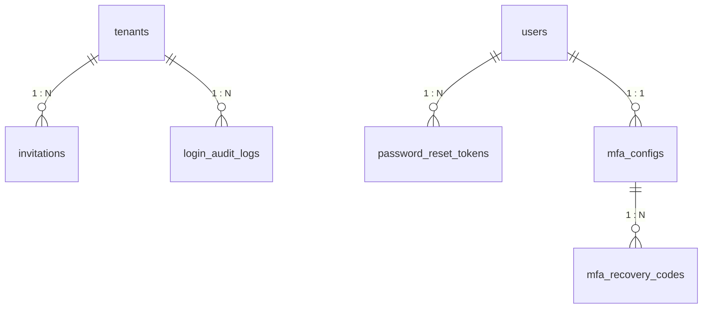
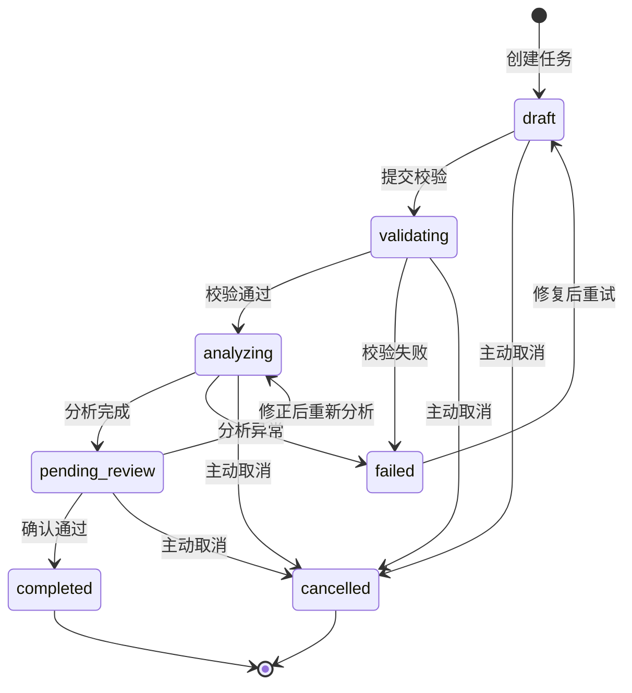

# ER 图与字段规范

基于 [数据库设计文档](./数据库设计文档.md) 提取的核心 ER 图与字段约束速查。

---

## 1. 核心实体关系总图



## 2. 任务继承关系



## 3. 认证模块关系



---

## 4. 全局字段规范

### 4.1 主键规范

所有表统一使用 UUID 主键，由数据库自动生成：

```sql
id UUID PRIMARY KEY DEFAULT gen_random_uuid()
```

### 4.2 时间戳规范

| 字段 | 类型 | 约束 | 说明 |
| --- | --- | --- | --- |
| `created_at` | `TIMESTAMPTZ` | `NOT NULL DEFAULT now()` | 记录创建时间，所有表必含 |
| `updated_at` | `TIMESTAMPTZ` | `NOT NULL DEFAULT now()` | 记录更新时间，含业务数据的表必含（审计日志表除外） |
| `deleted_at` | `TIMESTAMPTZ` | `DEFAULT NULL` | 软删除标记，需保留记录的表使用 |

**触发器**：`updated_at` 由 `BEFORE UPDATE` 触发器自动维护，不依赖应用层。

### 4.3 租户隔离规范

所有业务表（审计日志、通知等公共表同理）必须包含：

```sql
tenant_id UUID NOT NULL REFERENCES tenants(id)
```

查询强制带 `tenant_id` 过滤，数据库层通过 RLS 策略兜底。

### 4.4 金额与数值规范

| 类型 | 使用场景 |
| --- | --- |
| `INTEGER` | 计数器、数量、序号、分数（1-5） |
| `BIGINT` | 文件大小（字节） |
| `NUMERIC(3,2)` | 温度参数（0.00–1.00） |
| `NUMERIC(4,3)` | 权重（0.100–0.400） |
| `NUMERIC(5,1)` | 评分总分、换算分（0.0–100.0） |
| `NUMERIC(10,1)` | 预计人天 |

### 4.5 文本类型规范

| 类型 | 长度上限 | 使用场景 |
| --- | --- | --- |
| `VARCHAR(4)` | 4 | 优先级：P0/P1/P2/P3 |
| `VARCHAR(8)` | 8 | 评分方向、置信度 |
| `VARCHAR(16)` | 16 | 状态、级别、结果、协议 |
| `VARCHAR(32)` | 32 | 类型、角色、来源、维度、操作 |
| `VARCHAR(40)` | 40 | Git commit hash（提示词版本） |
| `VARCHAR(64)` | 64 | 模型名、版本号、slug、timezone |
| `VARCHAR(128)` | 128 | 名称、邮箱前缀、token hash、外部 ID |
| `VARCHAR(256)` | 256 | 邮箱、密码 hash、标题、文件名 |
| `VARCHAR(512)` | 512 | URL、密钥密文、引用位置 |
| `VARCHAR(1024)` | 1024 | 文件路径 |
| `TEXT` | 无上限 | 描述、摘要、正文、理由、DSL 逻辑 |

### 4.6 JSONB 字段使用规范

| 表 | JSONB 列 | 内容 |
| --- | --- | --- |
| `tenants` | `settings` | 租户级密码策略、MFA 策略等 |
| `data_sources` | `connection_config` | 加密后的连接参数 |
| `sso_configs` | `attribute_mapping` | IdP→平台属性映射 |
| `assessment_models` | `priority_thresholds` | P0-P3 阈值配置 |
| `check_issues` | `involved_deliverables` | 涉及交付物及引用位置数组 |
| `attribution_results` | `supporting_evidence` | 支持证据条目数组 |
| `attribution_results` | `counter_evidence` | 反向证据条目数组 |
| `attribution_results` | `missing_evidence` | 缺失证据条目数组 |
| `release_versions` | `associated_requirements` | 关联需求 UUID 数组 |
| `timeline_events` | `event_data` | 事件原始数据（结构精简版） |
| `snapshots` | `snapshot_data` | 快照的结构化元数据 |
| `snapshots` | `associated_deliverable_versions` | 关联交付物版本列表 |
| `audit_logs` | `changes_before` | 变更前值 |
| `audit_logs` | `changes_after` | 变更后值 |
| `assessment_confirmations` | `adjustments` | 调整详情 |
| `issue_assignments` | `waiver_approvals` | 豁免多方确认记录 |

### 4.7 软删除规范

以下表使用 `deleted_at` 实现软删除（`NULL` = 未删除）：

`tenants`、`users`、`projects`、`data_sources`、`requirements`、`deliverables`、`check_rules`、`release_versions`

以下表**不使用**软删除（记录本身即历史，直接物理删除或分区清理）：

`audit_logs`、`login_audit_logs`、`user_sessions`、`sync_records`、`notifications`、`exports`、`snapshots`

### 4.8 表名与字段名规范

- 表名：`snake_case` **复数形式**（`tasks`、`users`、`check_issues`）
- 字段名：`snake_case` **单数形式**（`project_id`、`created_at`）
- 外键：`{referenced_table_singular}_id`（如 `tenant_id` → `tenants.id`）
- 布尔字段：`is_` 前缀（`is_enabled`、`is_active`、`is_first_login`）
- 时间字段：`_at` 后缀（`created_at`、`locked_until`）
- 计数字段：`_count` 后缀（`retry_count`、`blocker_count`）
- JSONB 字段不使用 `_json` 后缀（类型已自描述）

---

## 5. 表间依赖关系（创建顺序）

```
第 1 层（无依赖）:
  tenants

第 2 层（依赖 tenants）:
  users, sso_configs, login_audit_logs

第 3 层（依赖 users, tenants）:
  user_sessions, mfa_configs, password_reset_tokens, invitations, projects

第 4 层（依赖 projects, users）:
  project_members, data_sources, requirements, deliverables,
  check_baselines, check_rules, release_versions, assessment_models

第 5 层（依赖上层业务表）:
  assessment_dimensions, mfa_recovery_codes

第 6 层（依赖 dimensions, data_sources）:
  assessment_scoring_anchors, sync_records, baseline_deliverables

第 7 层（核心：tasks）:
  tasks  ← 依赖 projects + users + snapshots

第 8 层（继承 tasks）:
  assessment_tasks, check_tasks, attribution_tasks

第 9 层（依赖子任务表）:
  assessment_dimension_scores, assessment_sensitivity_results,
  assessment_confirmations, check_issues, timeline_events,
  attribution_results, attribution_confirmations

第 10 层（依赖问题/结果/确认）:
  issue_assignments, issue_rechecks

第 11 层（公共记录，依赖 tasks）:
  snapshots, evidence_items, model_governance_records,
  audit_logs, notifications, exports
```

> 实际建表时，由于所有表均使用 UUID 主键，外键可在 `ALTER TABLE` 中后添加。`init.sql` 按先建表、后加约束的策略组织。

---

## 6. 外键关系速查

```
tenants.id
  ├── users.tenant_id                          RESTRICT
  ├── projects.tenant_id                       RESTRICT
  ├── sso_configs.tenant_id                    CASCADE
  ├── invitations.tenant_id                    CASCADE
  ├── login_audit_logs.tenant_id               RESTRICT
  ├── audit_logs.tenant_id                     RESTRICT
  ├── data_sources.tenant_id                   RESTRICT
  ├── requirements.tenant_id                   RESTRICT
  ├── deliverables.tenant_id                   RESTRICT
  ├── check_baselines.tenant_id                RESTRICT
  ├── check_rules.tenant_id                    RESTRICT
  ├── release_versions.tenant_id               RESTRICT
  ├── assessment_models.tenant_id              RESTRICT
  ├── tasks.tenant_id                          RESTRICT
  ├── snapshots.tenant_id                      RESTRICT
  ├── evidence_items.tenant_id                 RESTRICT
  ├── model_governance_records.tenant_id       RESTRICT
  ├── notifications.tenant_id                  RESTRICT
  └── exports.tenant_id                        RESTRICT

users.id
  ├── user_sessions.user_id                    CASCADE
  ├── mfa_configs.user_id                      CASCADE
  ├── password_reset_tokens.user_id            CASCADE
  ├── project_members.user_id                  CASCADE
  ├── tasks.created_by                         SET NULL
  ├── tasks.confirmed_by                       SET NULL
  └── (各种 assignee/operator/reviewer)         SET NULL

projects.id
  ├── project_members.project_id               CASCADE
  ├── data_sources.project_id                  CASCADE
  ├── requirements.project_id                  RESTRICT
  ├── deliverables.project_id                  RESTRICT
  ├── check_baselines.project_id               RESTRICT
  ├── check_rules.project_id                   SET NULL
  ├── release_versions.project_id              RESTRICT
  ├── assessment_models.project_id             RESTRICT
  └── tasks.project_id                         RESTRICT

tasks.id
  ├── assessment_tasks.task_id                 CASCADE
  ├── check_tasks.task_id                      CASCADE
  ├── attribution_tasks.task_id                CASCADE
  ├── snapshots.task_id                        RESTRICT
  ├── evidence_items.task_id                   RESTRICT
  ├── model_governance_records.task_id         RESTRICT
  └── exports.task_id                          RESTRICT

assessment_models.id
  └── assessment_dimensions.model_id           CASCADE

assessment_dimensions.id
  └── assessment_scoring_anchors.dimension_id  CASCADE

mfa_configs.id
  └── mfa_recovery_codes.mfa_config_id         CASCADE

data_sources.id
  └── sync_records.data_source_id              CASCADE

check_baselines.id
  ├── baseline_deliverables.baseline_id        CASCADE
  ├── check_tasks.baseline_id                  RESTRICT
  └── check_baselines.previous_baseline_id     SET NULL

check_tasks.id
  └── check_issues.check_task_id               RESTRICT

check_issues.id
  ├── issue_assignments.issue_id               CASCADE
  └── issue_rechecks.issue_id                  CASCADE

release_versions.id
  └── attribution_tasks.release_version_id     RESTRICT

attribution_tasks.id
  ├── timeline_events.attribution_task_id      CASCADE
  ├── attribution_results.attribution_task_id  CASCADE
  └── attribution_confirmations.attribution_task_id CASCADE
```

---

## 7. 关键唯一约束

| 表 | 唯一约束列 | 说明 |
| --- | --- | --- |
| `tenants` | `slug` | URL 友好标识全局唯一 |
| `users` | `(tenant_id, email)` | 同一租户内邮箱唯一 |
| `user_sessions` | `token_hash` | Session token 哈希唯一 |
| `mfa_configs` | `user_id` | 每个用户仅一条 MFA 配置 |
| `sso_configs` | `tenant_id` | 每个租户仅一条 SSO 配置 |
| `project_members` | `(project_id, user_id)` | 同一用户不能重复加入同一项目 |
| `assessment_scoring_anchors` | `(dimension_id, score)` | 每个维度每个分数仅一条锚点 |
| `assessment_tasks` | `task_id` | 通用任务一对一 |
| `check_tasks` | `task_id` | 通用任务一对一 |
| `attribution_tasks` | `task_id` | 通用任务一对一 |
| `baseline_deliverables` | `(baseline_id, deliverable_id)` | 基线内交付物不重复 |
| `check_baselines` | `(project_id, baseline_number)` | 项目内基线编号唯一 |
| `release_versions` | `(project_id, version_number)` | 项目内版本号唯一 |
| `snapshots` | `(task_type, task_id)` | 每个任务仅一份正式快照 |
| `model_governance_records` | `request_id` | API request_id 唯一 |

---

## 8. 任务状态流转图



```
Terminal states（不可再流转）:
  completed — 人工确认结束，形成正式结果
  cancelled — 创建人主动终止

可重试:
  failed → draft (retry_count 自增，retry_of_task_id 指向原任务)

不可逆操作:
  completed → 任何其他状态 ❌
  cancelled → 任何其他状态 ❌
```
