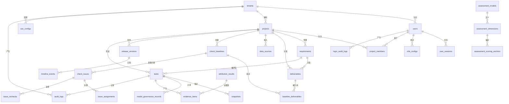
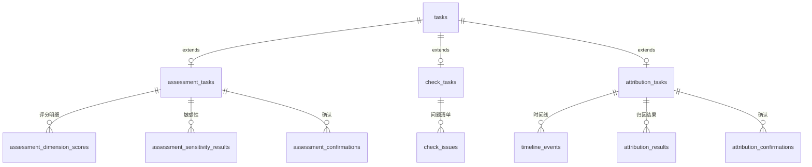

# 数据库设计文档

基于 [PRD V1.2](../../1_prd/产品管理智能助手平台_PRD.md) 和 [概要设计总纲](../../3_概要设计/概要设计_总纲.md) 编写。

## 1. 设计原则

| 原则 | 说明 | 对应 PRD |
| --- | --- | --- |
| 租户数据逻辑隔离 | 所有业务表带 `tenant_id`，查询强制过滤；检索、缓存、分析结果均带租户标识 | 9.3 |
| 分析任务输入快照不可变 | 任务提交后锁定输入快照，保证结论可复现；材料更新需创建新基线或新任务 | 5.1, 6.5 |
| 审计日志完整记录 | 登录、权限变更、任务操作、结论修改等关键操作全量记录，普通用户不可修改或删除 | 7.2 |
| 敏感数据脱敏后存储 | 手机号、身份证号、邮箱、密钥在进入 RAG 管道和大模型前脱敏；原始凭据存入专用凭据管理服务 | 9.3, 9.5 |
| 模型治理信息与任务绑定 | 每次 LLM 调用记录模型名称、版本、提示词版本（Git commit hash）、温度参数、token 用量 | 9.5 |
| 规则优先于模型 | 确定性冲突由规则引擎判定后，再送大模型做语义比对，降低调用成本和延迟 | 6.3.2 |
| 人工决策节点 | 评分确认、问题豁免、归因结论必须经人工确认，关键调整需复核 | 6.2.5, 6.3.5, 6.4.6 |
| 基线不可变 | 每次正式检查生成不可变基线编号，新增或删除交付物后必须生成新基线 | 6.3.6 |

---

## 2. ER 图

### 2.1 核心实体关系



### 2.2 任务继承关系



---

## 3. 表结构设计

### 命名与字段规范

- 表名：`snake_case` 复数形式
- 主键：`id UUID PRIMARY KEY DEFAULT gen_random_uuid()`
- 时间戳：每表必有 `created_at TIMESTAMPTZ NOT NULL DEFAULT now()` 和 `updated_at TIMESTAMPTZ NOT NULL DEFAULT now()`
- 软删除：`deleted_at TIMESTAMPTZ`

### 3.1 通用任务表（tasks）

三类分析任务共享统一状态机，抽取为通用任务主表。LangGraph 工作流节点直接映射到状态字段。

| 字段 | 类型 | 约束 | 默认值 | 说明 |
| --- | --- | --- | --- | --- |
| `id` | `UUID` | `PRIMARY KEY` | `gen_random_uuid()` | 任务唯一标识 |
| `tenant_id` | `UUID` | `NOT NULL, FK → tenants.id` | — | 所属租户 |
| `project_id` | `UUID` | `NOT NULL, FK → projects.id` | — | 所属项目 |
| `task_type` | `VARCHAR(32)` | `NOT NULL` | — | 任务类型：`assessment` / `consistency_check` / `attribution` |
| `status` | `VARCHAR(32)` | `NOT NULL` | `'draft'` | 任务状态（见下方状态机） |
| `title` | `VARCHAR(256)` | `NOT NULL` | — | 任务标题 |
| `description` | `TEXT` | — | — | 任务描述/备注 |
| `input_snapshot_id` | `UUID` | `FK → snapshots.id` | — | 输入快照引用 |
| `model_name` | `VARCHAR(64)` | — | — | 使用的大模型名称，如 `claude-opus-4-8` |
| `model_version` | `VARCHAR(64)` | — | — | 大模型 API 返回的版本标识 |
| `prompt_version` | `VARCHAR(40)` | — | — | 提示词模板 Git commit hash |
| `temperature` | `NUMERIC(3,2)` | — | `0.3` | 大模型温度参数 |
| `created_by` | `UUID` | `NOT NULL, FK → users.id` | — | 任务创建人 |
| `confirmed_by` | `UUID` | `FK → users.id` | — | 最终确认人 |
| `confirmed_at` | `TIMESTAMPTZ` | — | — | 确认时间 |
| `completed_at` | `TIMESTAMPTZ` | — | — | 完成时间 |
| `failure_reason` | `TEXT` | — | — | 失败原因（状态为 `failed` 时填写） |
| `retry_count` | `INTEGER` | `NOT NULL` | `0` | 重试次数 |
| `retry_of_task_id` | `UUID` | `FK → tasks.id` | — | 如果是重试任务，指向原始任务 |
| `error_details` | `JSONB` | — | — | 详细错误信息（堆栈、阶段、节点名） |
| `created_at` | `TIMESTAMPTZ` | `NOT NULL` | `now()` | 创建时间 |
| `updated_at` | `TIMESTAMPTZ` | `NOT NULL` | `now()` | 更新时间 |

**任务状态机**（与 PRD 5.1 及 LangGraph 节点映射）：

```
draft ──────► validating ──────► analyzing ──────► pending_review ──────► completed
  │                                  │                    │
  └────────── cancelled              ▼                    ├──► completed (confirmed)
                               failed (可重试)           └──► analyzing (修正后重分析)
```

| 状态 | LangGraph 节点 | 说明 |
| --- | --- | --- |
| `draft` | — | 草稿，可修改输入 |
| `validating` | `input_validation` | 系统校验输入完整性及数据源可用性 |
| `analyzing` | `lock_snapshot → retrieval → rule_check → llm_analyze → evidence_link → confidence_calc` | 锁定快照并执行分析 |
| `pending_review` | `human_review` | 分析完成，等待人工确认（中断点） |
| `completed` | `result_finalize` | 人工确认结束，形成正式结果 |
| `failed` | `error_handler` | 因数据、权限或系统错误未完成 |
| `cancelled` | — | 创建人主动终止 |

### 3.2 租户与用户认证模块

#### 3.2.1 tenants — 租户信息

| 字段 | 类型 | 约束 | 默认值 | 说明 |
| --- | --- | --- | --- | --- |
| `id` | `UUID` | `PRIMARY KEY` | `gen_random_uuid()` | 租户唯一标识 |
| `name` | `VARCHAR(128)` | `NOT NULL, UNIQUE` | — | 租户名称 |
| `slug` | `VARCHAR(64)` | `NOT NULL, UNIQUE` | — | URL 友好的租户标识 |
| `admin_user_id` | `UUID` | `FK → users.id` | — | 租户管理员（创建时指定） |
| `status` | `VARCHAR(16)` | `NOT NULL` | `'active'` | 状态：`active` / `suspended` / `disabled` |
| `max_users` | `INTEGER` | — | — | 用户数上限（NULL 表示不限制） |
| `max_projects` | `INTEGER` | — | — | 项目数上限 |
| `settings` | `JSONB` | — | `'{}'` | 租户级配置（密码策略、MFA 策略等） |
| `created_at` | `TIMESTAMPTZ` | `NOT NULL` | `now()` | 创建时间 |
| `updated_at` | `TIMESTAMPTZ` | `NOT NULL` | `now()` | 更新时间 |
| `deleted_at` | `TIMESTAMPTZ` | — | — | 软删除时间 |

#### 3.2.2 users — 用户账号

| 字段 | 类型 | 约束 | 默认值 | 说明 |
| --- | --- | --- | --- | --- |
| `id` | `UUID` | `PRIMARY KEY` | `gen_random_uuid()` | 用户唯一标识 |
| `tenant_id` | `UUID` | `NOT NULL, FK → tenants.id` | — | 所属租户 |
| `email` | `VARCHAR(256)` | `NOT NULL` | — | 邮箱（登录名），租户内唯一 |
| `password_hash` | `VARCHAR(256)` | — | — | bcrypt/argon2 密码哈希，SSO 用户可为空 |
| `name` | `VARCHAR(128)` | `NOT NULL` | — | 显示名 |
| `avatar_url` | `VARCHAR(512)` | — | — | 头像 URL |
| `role` | `VARCHAR(32)` | `NOT NULL` | `'project_member'` | 租户级角色：`tenant_admin` / `project_member` |
| `is_first_login` | `BOOLEAN` | `NOT NULL` | `true` | 首次登录标记（强制修改初始密码） |
| `locked_until` | `TIMESTAMPTZ` | — | — | 账号锁定截止时间 |
| `failed_login_count` | `INTEGER` | `NOT NULL` | `0` | 连续登录失败次数 |
| `password_changed_at` | `TIMESTAMPTZ` | — | — | 上次密码修改时间 |
| `last_login_at` | `TIMESTAMPTZ` | — | — | 上次登录成功时间 |
| `last_login_ip` | `INET` | — | — | 上次登录 IP |
| `auth_provider` | `VARCHAR(16)` | `NOT NULL` | `'local'` | 认证方式：`local` / `sso` / `ldap` |
| `sso_external_id` | `VARCHAR(256)` | — | — | IdP 返回的用户唯一标识 |
| `created_at` | `TIMESTAMPTZ` | `NOT NULL` | `now()` | 创建时间 |
| `updated_at` | `TIMESTAMPTZ` | `NOT NULL` | `now()` | 更新时间 |
| `deleted_at` | `TIMESTAMPTZ` | — | — | 软删除时间 |

- **唯一约束**：`UNIQUE(tenant_id, email)` — 同一租户内邮箱唯一

#### 3.2.3 user_sessions — 服务端会话记录

| 字段 | 类型 | 约束 | 默认值 | 说明 |
| --- | --- | --- | --- | --- |
| `id` | `UUID` | `PRIMARY KEY` | `gen_random_uuid()` | 会话唯一标识 |
| `user_id` | `UUID` | `NOT NULL, FK → users.id` | — | 用户 |
| `token_hash` | `VARCHAR(128)` | `NOT NULL, UNIQUE` | — | Session token 的 SHA-256 哈希 |
| `device_info` | `VARCHAR(256)` | — | — | 设备识别信息 |
| `ip_address` | `INET` | `NOT NULL` | — | 登录 IP |
| `user_agent` | `TEXT` | — | — | 浏览器 User-Agent |
| `logged_in_at` | `TIMESTAMPTZ` | `NOT NULL` | `now()` | 登录时间 |
| `last_active_at` | `TIMESTAMPTZ` | `NOT NULL` | `now()` | 最后活跃时间 |
| `expires_at` | `TIMESTAMPTZ` | `NOT NULL` | — | 绝对过期时间（登录后 12 小时） |
| `is_active` | `BOOLEAN` | `NOT NULL` | `true` | 会话是否活跃 |
| `terminated_reason` | `VARCHAR(64)` | — | — | 终止原因：`logout` / `timeout` / `password_change` / `admin_force` / `concurrent_limit` |
| `created_at` | `TIMESTAMPTZ` | `NOT NULL` | `now()` | 创建时间 |
| `updated_at` | `TIMESTAMPTZ` | `NOT NULL` | `now()` | 更新时间 |

#### 3.2.4 mfa_configs — MFA 配置

| 字段 | 类型 | 约束 | 默认值 | 说明 |
| --- | --- | --- | --- | --- |
| `id` | `UUID` | `PRIMARY KEY` | `gen_random_uuid()` | MFA 配置唯一标识 |
| `user_id` | `UUID` | `NOT NULL, UNIQUE, FK → users.id` | — | 用户（一对一） |
| `totp_secret_encrypted` | `VARCHAR(512)` | `NOT NULL` | — | TOTP 密钥（AES-256-GCM 加密存储） |
| `is_enabled` | `BOOLEAN` | `NOT NULL` | `false` | 是否启用 MFA |
| `bound_at` | `TIMESTAMPTZ` | — | — | 绑定时间 |
| `last_used_at` | `TIMESTAMPTZ` | — | — | 上次验证通过时间 |
| `created_at` | `TIMESTAMPTZ` | `NOT NULL` | `now()` | 创建时间 |
| `updated_at` | `TIMESTAMPTZ` | `NOT NULL` | `now()` | 更新时间 |

#### 3.2.5 mfa_recovery_codes — 恢复码

| 字段 | 类型 | 约束 | 默认值 | 说明 |
| --- | --- | --- | --- | --- |
| `id` | `UUID` | `PRIMARY KEY` | `gen_random_uuid()` | 恢复码唯一标识 |
| `mfa_config_id` | `UUID` | `NOT NULL, FK → mfa_configs.id` | — | 所属 MFA 配置 |
| `code_hash` | `VARCHAR(128)` | `NOT NULL` | — | 恢复码的 SHA-256 哈希 |
| `is_used` | `BOOLEAN` | `NOT NULL` | `false` | 是否已使用 |
| `used_at` | `TIMESTAMPTZ` | — | — | 使用时间 |
| `created_at` | `TIMESTAMPTZ` | `NOT NULL` | `now()` | 创建时间 |

- 每个 `mfa_config_id` 最多 8 条记录（生成 8 个恢复码）

#### 3.2.6 sso_configs — SSO 配置（租户级）

| 字段 | 类型 | 约束 | 默认值 | 说明 |
| --- | --- | --- | --- | --- |
| `id` | `UUID` | `PRIMARY KEY` | `gen_random_uuid()` | SSO 配置唯一标识 |
| `tenant_id` | `UUID` | `NOT NULL, UNIQUE, FK → tenants.id` | — | 租户（一对一） |
| `protocol` | `VARCHAR(16)` | `NOT NULL` | — | 协议类型：`saml2` / `oidc` |
| `idp_metadata_url` | `VARCHAR(512)` | — | — | IdP 元数据 URL |
| `idp_metadata_xml` | `TEXT` | — | — | IdP 元数据 XML 内容（上传模式） |
| `idp_entity_id` | `VARCHAR(512)` | — | — | IdP Entity ID |
| `idp_sso_url` | `VARCHAR(512)` | — | — | IdP 单点登录 URL |
| `idp_certificate` | `TEXT` | — | — | IdP 签名证书（PEM） |
| `sp_entity_id` | `VARCHAR(512)` | — | — | SP Entity ID |
| `sp_acs_url` | `VARCHAR(512)` | — | — | SP Assertion Consumer Service URL |
| `attribute_mapping` | `JSONB` | `NOT NULL` | `'{}'` | IdP 属性→用户属性映射，如 `{"email":"mail","name":"displayName"}` |
| `allowed_email_domains` | `TEXT[]` | — | — | Just-in-Time 创建允许的邮箱域名白名单 |
| `jit_provisioning` | `BOOLEAN` | `NOT NULL` | `false` | 是否启用 Just-in-Time 用户创建 |
| `is_enabled` | `BOOLEAN` | `NOT NULL` | `false` | 是否启用 SSO |
| `last_tested_at` | `TIMESTAMPTZ` | — | — | 上次连通性测试时间 |
| `created_at` | `TIMESTAMPTZ` | `NOT NULL` | `now()` | 创建时间 |
| `updated_at` | `TIMESTAMPTZ` | `NOT NULL` | `now()` | 更新时间 |

#### 3.2.7 password_reset_tokens — 密码重置令牌

| 字段 | 类型 | 约束 | 默认值 | 说明 |
| --- | --- | --- | --- | --- |
| `id` | `UUID` | `PRIMARY KEY` | `gen_random_uuid()` | 令牌唯一标识 |
| `user_id` | `UUID` | `NOT NULL, FK → users.id` | — | 用户 |
| `token_hash` | `VARCHAR(128)` | `NOT NULL` | — | 重置令牌的 SHA-256 哈希 |
| `expires_at` | `TIMESTAMPTZ` | `NOT NULL` | — | 过期时间（创建后 30 分钟） |
| `is_used` | `BOOLEAN` | `NOT NULL` | `false` | 是否已使用 |
| `used_at` | `TIMESTAMPTZ` | — | — | 使用时间 |
| `created_at` | `TIMESTAMPTZ` | `NOT NULL` | `now()` | 创建时间 |

#### 3.2.8 invitations — 成员邀请记录

| 字段 | 类型 | 约束 | 默认值 | 说明 |
| --- | --- | --- | --- | --- |
| `id` | `UUID` | `PRIMARY KEY` | `gen_random_uuid()` | 邀请唯一标识 |
| `tenant_id` | `UUID` | `NOT NULL, FK → tenants.id` | — | 所属租户 |
| `inviter_id` | `UUID` | `NOT NULL, FK → users.id` | — | 邀请人 |
| `email` | `VARCHAR(256)` | `NOT NULL` | — | 被邀请人邮箱 |
| `token_hash` | `VARCHAR(128)` | `NOT NULL` | — | 邀请 token 的 SHA-256 哈希 |
| `expires_at` | `TIMESTAMPTZ` | `NOT NULL` | — | 过期时间（创建后 48 小时） |
| `is_activated` | `BOOLEAN` | `NOT NULL` | `false` | 是否已激活 |
| `activated_user_id` | `UUID` | `FK → users.id` | — | 激活后创建的用户 ID |
| `activated_at` | `TIMESTAMPTZ` | — | — | 激活时间 |
| `created_at` | `TIMESTAMPTZ` | `NOT NULL` | `now()` | 创建时间 |
| `updated_at` | `TIMESTAMPTZ` | `NOT NULL` | `now()` | 更新时间 |

#### 3.2.9 login_audit_logs — 登录审计日志

| 字段 | 类型 | 约束 | 默认值 | 说明 |
| --- | --- | --- | --- | --- |
| `id` | `UUID` | `PRIMARY KEY` | `gen_random_uuid()` | 日志唯一标识 |
| `tenant_id` | `UUID` | `NOT NULL, FK → tenants.id` | — | 所属租户 |
| `user_id` | `UUID` | `FK → users.id` | — | 用户（已知用户时填写） |
| `email` | `VARCHAR(256)` | — | — | 尝试登录的邮箱 |
| `operation` | `VARCHAR(32)` | `NOT NULL` | — | 操作类型：`login` / `logout` / `password_change` / `password_reset` / `mfa_enable` / `mfa_disable` / `session_terminated` / `account_locked` / `account_unlocked` / `sso_config_change` |
| `result` | `VARCHAR(16)` | `NOT NULL` | — | 结果：`success` / `failure` |
| `failure_reason` | `VARCHAR(128)` | — | — | 失败原因：`invalid_password` / `account_locked` / `mfa_required` / `mfa_failed` / `session_expired` / `sso_error` |
| `ip_address` | `INET` | `NOT NULL` | — | 来源 IP |
| `user_agent` | `TEXT` | — | — | 浏览器 User-Agent |
| `device_fingerprint` | `VARCHAR(128)` | — | — | 设备指纹（用于新设备检测） |
| `metadata` | `JSONB` | — | `'{}'` | 扩展信息 |
| `created_at` | `TIMESTAMPTZ` | `NOT NULL` | `now()` | 操作时间 |

- 审计日志不可修改、不可删除（普通用户），无 `updated_at` / `deleted_at`
- 使用分区表，按月份分区（见第 5 节）

### 3.3 项目与数据源管理模块

#### 3.3.1 projects — 项目信息

| 字段 | 类型 | 约束 | 默认值 | 说明 |
| --- | --- | --- | --- | --- |
| `id` | `UUID` | `PRIMARY KEY` | `gen_random_uuid()` | 项目唯一标识 |
| `tenant_id` | `UUID` | `NOT NULL, FK → tenants.id` | — | 所属租户 |
| `name` | `VARCHAR(128)` | `NOT NULL` | — | 项目名称 |
| `description` | `TEXT` | — | — | 项目描述 |
| `status` | `VARCHAR(16)` | `NOT NULL` | `'active'` | 状态：`active` / `archived` / `suspended` |
| `timezone` | `VARCHAR(64)` | `NOT NULL` | `'Asia/Shanghai'` | 项目时区（用于时间线统一展示，PRD 6.4.2） |
| `settings` | `JSONB` | — | `'{}'` | 项目级配置 |
| `created_at` | `TIMESTAMPTZ` | `NOT NULL` | `now()` | 创建时间 |
| `updated_at` | `TIMESTAMPTZ` | `NOT NULL` | `now()` | 更新时间 |
| `deleted_at` | `TIMESTAMPTZ` | — | — | 软删除时间 |

#### 3.3.2 project_members — 项目成员关系

| 字段 | 类型 | 约束 | 默认值 | 说明 |
| --- | --- | --- | --- | --- |
| `id` | `UUID` | `PRIMARY KEY` | `gen_random_uuid()` | 关系唯一标识 |
| `project_id` | `UUID` | `NOT NULL, FK → projects.id` | — | 项目 |
| `user_id` | `UUID` | `NOT NULL, FK → users.id` | — | 用户 |
| `role` | `VARCHAR(32)` | `NOT NULL` | `'project_member'` | 项目内角色：`project_admin` / `project_member` / `viewer` |
| `joined_at` | `TIMESTAMPTZ` | `NOT NULL` | `now()` | 加入时间 |
| `created_at` | `TIMESTAMPTZ` | `NOT NULL` | `now()` | 创建时间 |
| `updated_at` | `TIMESTAMPTZ` | `NOT NULL` | `now()` | 更新时间 |

- **唯一约束**：`UNIQUE(project_id, user_id)` — 同一用户不能重复加入同一项目

#### 3.3.3 data_sources — 外部数据源连接配置

| 字段 | 类型 | 约束 | 默认值 | 说明 |
| --- | --- | --- | --- | --- |
| `id` | `UUID` | `PRIMARY KEY` | `gen_random_uuid()` | 数据源唯一标识 |
| `tenant_id` | `UUID` | `NOT NULL, FK → tenants.id` | — | 所属租户 |
| `project_id` | `UUID` | `NOT NULL, FK → projects.id` | — | 所属项目 |
| `name` | `VARCHAR(128)` | `NOT NULL` | — | 数据源名称 |
| `source_type` | `VARCHAR(32)` | `NOT NULL` | — | 类型：`prd_repo` / `api_platform` / `tracking_system` / `code_repo` / `monitoring` / `logging` / `ticketing` |
| `connection_config` | `JSONB` | `NOT NULL` | — | 连接配置（AES-256-GCM 加密），含 endpoint、认证信息等 |
| `sync_interval` | `INTEGER` | — | `3600` | 同步间隔（秒），NULL 表示仅手动同步 |
| `status` | `VARCHAR(16)` | `NOT NULL` | `'disconnected'` | 连接状态：`connected` / `disconnected` / `error` |
| `last_sync_at` | `TIMESTAMPTZ` | — | — | 上次同步时间 |
| `last_sync_status` | `VARCHAR(16)` | — | — | 上次同步结果：`success` / `partial` / `failure` |
| `error_message` | `TEXT` | — | — | 最近错误信息 |
| `created_by` | `UUID` | `NOT NULL, FK → users.id` | — | 创建人 |
| `created_at` | `TIMESTAMPTZ` | `NOT NULL` | `now()` | 创建时间 |
| `updated_at` | `TIMESTAMPTZ` | `NOT NULL` | `now()` | 更新时间 |
| `deleted_at` | `TIMESTAMPTZ` | — | — | 软删除时间 |

#### 3.3.4 sync_records — 同步记录

| 字段 | 类型 | 约束 | 默认值 | 说明 |
| --- | --- | --- | --- | --- |
| `id` | `UUID` | `PRIMARY KEY` | `gen_random_uuid()` | 同步记录唯一标识 |
| `data_source_id` | `UUID` | `NOT NULL, FK → data_sources.id` | — | 数据源 |
| `sync_type` | `VARCHAR(16)` | `NOT NULL` | — | 同步类型：`manual` / `scheduled` |
| `started_at` | `TIMESTAMPTZ` | `NOT NULL` | — | 同步开始时间 |
| `ended_at` | `TIMESTAMPTZ` | — | — | 同步结束时间 |
| `sync_scope` | `JSONB` | — | — | 同步范围描述（项目、文档类型、时间窗等） |
| `result` | `VARCHAR(16)` | `NOT NULL` | — | 结果：`success` / `partial` / `failure` |
| `failure_reason` | `TEXT` | — | — | 失败/部分失败原因 |
| `items_added` | `INTEGER` | `NOT NULL` | `0` | 新增数量 |
| `items_updated` | `INTEGER` | `NOT NULL` | `0` | 更新数量 |
| `items_deleted` | `INTEGER` | `NOT NULL` | `0` | 删除数量 |
| `items_failed` | `INTEGER` | `NOT NULL` | `0` | 处理失败数量 |
| `error_details` | `JSONB` | — | — | 详细错误（按文档/条目列出） |
| `triggered_by` | `UUID` | `FK → users.id` | — | 触发人（手动触发时填写） |
| `created_at` | `TIMESTAMPTZ` | `NOT NULL` | `now()` | 创建时间 |

### 3.4 需求池与评估模型模块

#### 3.4.1 requirements — 需求池

| 字段 | 类型 | 约束 | 默认值 | 说明 |
| --- | --- | --- | --- | --- |
| `id` | `UUID` | `PRIMARY KEY` | `gen_random_uuid()` | 需求唯一标识 |
| `tenant_id` | `UUID` | `NOT NULL, FK → tenants.id` | — | 所属租户 |
| `project_id` | `UUID` | `NOT NULL, FK → projects.id` | — | 所属项目 |
| `external_id` | `VARCHAR(128)` | — | — | 外部系统需求编号 |
| `name` | `VARCHAR(256)` | `NOT NULL` | — | 需求名称 |
| `background` | `TEXT` | — | — | 需求背景 |
| `target_users` | `TEXT` | — | — | 目标用户描述 |
| `core_scenarios` | `TEXT` | — | — | 核心场景描述 |
| `user_coverage_description` | `TEXT` | — | — | 用户覆盖范围说明及统计口径 |
| `business_value_description` | `TEXT` | — | — | 业务价值说明及目标指标 |
| `strategic_alignment` | `TEXT` | — | — | 与公司/产品战略的关联说明 |
| `estimated_man_days` | `NUMERIC(10,1)` | — | — | 预计人天 |
| `estimated_duration_days` | `INTEGER` | — | — | 预计工期（天） |
| `technical_complexity` | `VARCHAR(16)` | — | — | 技术复杂度：`low` / `medium` / `high` / `critical` |
| `dependencies` | `TEXT` | — | — | 依赖说明 |
| `business_risks` | `TEXT` | — | — | 业务风险 |
| `technical_risks` | `TEXT` | — | — | 技术风险 |
| `compliance_risks` | `TEXT` | — | — | 合规风险 |
| `delivery_risks` | `TEXT` | — | — | 交付风险 |
| `proposer_id` | `UUID` | `FK → users.id` | — | 需求提出人 |
| `assignee_id` | `UUID` | `FK → users.id` | — | 负责人 |
| `expected_launch_date` | `DATE` | — | — | 期望上线时间 |
| `status` | `VARCHAR(32)` | `NOT NULL` | `'draft'` | 状态：`draft` / `submitted` / `evaluating` / `prioritized` / `scheduled` / `in_development` / `closed` |
| `current_priority` | `VARCHAR(4)` | — | — | 当前优先级：`P0` / `P1` / `P2` / `P3` |
| `current_total_score` | `NUMERIC(5,1)` | — | — | 最新评估总分 |
| `latest_assessment_task_id` | `UUID` | `FK → tasks.id` | — | 最新评估任务 ID（便于快速跳转） |
| `created_at` | `TIMESTAMPTZ` | `NOT NULL` | `now()` | 创建时间 |
| `updated_at` | `TIMESTAMPTZ` | `NOT NULL` | `now()` | 更新时间 |
| `deleted_at` | `TIMESTAMPTZ` | — | — | 软删除时间 |

#### 3.4.2 assessment_models — 评估模型版本

| 字段 | 类型 | 约束 | 默认值 | 说明 |
| --- | --- | --- | --- | --- |
| `id` | `UUID` | `PRIMARY KEY` | `gen_random_uuid()` | 模型版本唯一标识 |
| `tenant_id` | `UUID` | `NOT NULL, FK → tenants.id` | — | 所属租户 |
| `project_id` | `UUID` | `NOT NULL, FK → projects.id` | — | 所属项目 |
| `name` | `VARCHAR(128)` | `NOT NULL` | — | 模型名称 |
| `version` | `INTEGER` | `NOT NULL` | `1` | 版本号（自增） |
| `total_score_formula` | `TEXT` | `NOT NULL` | — | 总分计算公式（DSL） |
| `priority_thresholds` | `JSONB` | `NOT NULL` | — | 优先级阈值配置，如 `{"P0":80,"P1":65,"P2":50}` |
| `status` | `VARCHAR(16)` | `NOT NULL` | `'draft'` | 状态：`draft` / `active` / `retired` |
| `effective_from` | `TIMESTAMPTZ` | — | — | 生效时间 |
| `effective_to` | `TIMESTAMPTZ` | — | — | 失效时间 |
| `created_by` | `UUID` | `NOT NULL, FK → users.id` | — | 创建人 |
| `created_at` | `TIMESTAMPTZ` | `NOT NULL` | `now()` | 创建时间 |
| `updated_at` | `TIMESTAMPTZ` | `NOT NULL` | `now()` | 更新时间 |

- 模型修改仅作用于新任务；历史任务保留原模型版本（通过任务快照绑定）

#### 3.4.3 assessment_dimensions — 模型维度配置

| 字段 | 类型 | 约束 | 默认值 | 说明 |
| --- | --- | --- | --- | --- |
| `id` | `UUID` | `PRIMARY KEY` | `gen_random_uuid()` | 维度唯一标识 |
| `model_id` | `UUID` | `NOT NULL, FK → assessment_models.id` | — | 所属模型版本 |
| `name` | `VARCHAR(64)` | `NOT NULL` | — | 维度名称：`用户覆盖` / `业务价值` / `战略匹配度` / `实现成本` / `风险` |
| `weight` | `NUMERIC(4,3)` | `NOT NULL` | — | 权重（0.100–0.400，所有维度之和 = 1.000） |
| `scoring_direction` | `VARCHAR(8)` | `NOT NULL` | `'positive'` | 评分方向：`positive`（正向，越高越优）/ `negative`（反向，越低越优） |
| `sort_order` | `INTEGER` | `NOT NULL` | `0` | 排序序号 |
| `created_at` | `TIMESTAMPTZ` | `NOT NULL` | `now()` | 创建时间 |
| `updated_at` | `TIMESTAMPTZ` | `NOT NULL` | `now()` | 更新时间 |

- **约束**：同一模型的维度权重之和必须为 1.000

#### 3.4.4 assessment_scoring_anchors — 评分锚点

| 字段 | 类型 | 约束 | 默认值 | 说明 |
| --- | --- | --- | --- | --- |
| `id` | `UUID` | `PRIMARY KEY` | `gen_random_uuid()` | 锚点唯一标识 |
| `dimension_id` | `UUID` | `NOT NULL, FK → assessment_dimensions.id` | — | 所属维度 |
| `score` | `INTEGER` | `NOT NULL` | — | 分数（1-5） |
| `description` | `TEXT` | `NOT NULL` | — | 该分数的描述 |
| `criteria` | `TEXT` | `NOT NULL` | — | 判定标准（供大模型评分的参照依据） |
| `created_at` | `TIMESTAMPTZ` | `NOT NULL` | `now()` | 创建时间 |
| `updated_at` | `TIMESTAMPTZ` | `NOT NULL` | `now()` | 更新时间 |

- **唯一约束**：`UNIQUE(dimension_id, score)` — 每个维度每个分数仅一条锚点

#### 3.4.5 assessment_tasks — 评估任务（继承 tasks）

| 字段 | 类型 | 约束 | 默认值 | 说明 |
| --- | --- | --- | --- | --- |
| `id` | `UUID` | `PRIMARY KEY` | `gen_random_uuid()` | 评估任务标识（同时为 FK → tasks.id） |
| `task_id` | `UUID` | `NOT NULL, UNIQUE, FK → tasks.id` | — | 通用任务 ID |
| `requirement_id` | `UUID` | `NOT NULL, FK → requirements.id` | — | 被评估的需求 |
| `model_id` | `UUID` | `NOT NULL, FK → assessment_models.id` | — | 使用的评估模型版本 |
| `total_score` | `NUMERIC(5,1)` | — | — | 评估总分 |
| `suggested_priority` | `VARCHAR(4)` | — | — | 建议优先级：`P0` / `P1` / `P2` / `P3` |
| `has_risk_flag` | `BOOLEAN` | `NOT NULL` | `false` | 是否包含风险标记（合规红线、关键依赖未解决、风险维度 5 分） |
| `risk_flag_detail` | `TEXT` | — | — | 风险标记详情 |
| `created_at` | `TIMESTAMPTZ` | `NOT NULL` | `now()` | 创建时间 |
| `updated_at` | `TIMESTAMPTZ` | `NOT NULL` | `now()` | 更新时间 |

#### 3.4.6 assessment_dimension_scores — 各维度评分明细

| 字段 | 类型 | 约束 | 默认值 | 说明 |
| --- | --- | --- | --- | --- |
| `id` | `UUID` | `PRIMARY KEY` | `gen_random_uuid()` | 评分明细唯一标识 |
| `assessment_task_id` | `UUID` | `NOT NULL, FK → assessment_tasks.id` | — | 所属评估任务 |
| `dimension_id` | `UUID` | `NOT NULL, FK → assessment_dimensions.id` | — | 使用的维度（关联到模型版本的维度快照） |
| `raw_score` | `INTEGER` | `NOT NULL` | — | 原始分（1-5） |
| `converted_score` | `NUMERIC(5,1)` | `NOT NULL` | — | 换算分（正向：raw/5×100，反向：(6-raw)/5×100） |
| `evidence_citations` | `TEXT` | — | — | 证据引用（引自输入材料的事实） |
| `inference_explanation` | `TEXT` | — | — | 推断说明（大模型基于锚点的推断，标注为推断） |
| `missing_evidence` | `TEXT` | — | — | 证据缺失说明 |
| `confidence` | `VARCHAR(8)` | `NOT NULL` | `'medium'` | 置信度：`high` / `medium` / `low` |
| `created_at` | `TIMESTAMPTZ` | `NOT NULL` | `now()` | 创建时间 |

#### 3.4.7 assessment_sensitivity_results — 敏感性分析结果

| 字段 | 类型 | 约束 | 默认值 | 说明 |
| --- | --- | --- | --- | --- |
| `id` | `UUID` | `PRIMARY KEY` | `gen_random_uuid()` | 敏感性结果唯一标识 |
| `assessment_task_id` | `UUID` | `NOT NULL, FK → assessment_tasks.id` | — | 所属评估任务 |
| `adjusted_weights` | `JSONB` | `NOT NULL` | — | 调整后的权重（各维度 ±10%） |
| `adjusted_total_score` | `NUMERIC(5,1)` | `NOT NULL` | — | 调整后总分 |
| `priority_changed` | `BOOLEAN` | `NOT NULL` | `false` | 优先级是否变化 |
| `original_priority` | `VARCHAR(4)` | — | — | 原优先级 |
| `new_priority` | `VARCHAR(4)` | — | — | 新优先级 |
| `created_at` | `TIMESTAMPTZ` | `NOT NULL` | `now()` | 创建时间 |

#### 3.4.8 assessment_confirmations — 人工确认记录

| 字段 | 类型 | 约束 | 默认值 | 说明 |
| --- | --- | --- | --- | --- |
| `id` | `UUID` | `PRIMARY KEY` | `gen_random_uuid()` | 确认记录唯一标识 |
| `assessment_task_id` | `UUID` | `NOT NULL, FK → assessment_tasks.id` | — | 所属评估任务 |
| `confirmed_by` | `UUID` | `NOT NULL, FK → users.id` | — | 确认人 |
| `confirmation_type` | `VARCHAR(16)` | `NOT NULL` | — | 确认类型：`accept` / `revise` / `reject` |
| `adjustments` | `JSONB` | — | — | 调整详情（修改的维度和分数、优先级等） |
| `adjustment_reason` | `TEXT` | — | — | 调整理由（修改时必须填写） |
| `needs_review` | `BOOLEAN` | `NOT NULL` | `false` | 是否需要复核（P0 或跨两级调整时标记） |
| `reviewer_id` | `UUID` | `FK → users.id` | — | 复核人 |
| `review_status` | `VARCHAR(16)` | — | — | 复核状态：`pending` / `approved` / `rejected` |
| `review_comment` | `TEXT` | — | — | 复核意见 |
| `reviewed_at` | `TIMESTAMPTZ` | — | — | 复核时间 |
| `created_at` | `TIMESTAMPTZ` | `NOT NULL` | `now()` | 创建时间 |

### 3.5 交付物一致性检查模块

#### 3.5.1 deliverables — 交付物

| 字段 | 类型 | 约束 | 默认值 | 说明 |
| --- | --- | --- | --- | --- |
| `id` | `UUID` | `PRIMARY KEY` | `gen_random_uuid()` | 交付物唯一标识 |
| `tenant_id` | `UUID` | `NOT NULL, FK → tenants.id` | — | 所属租户 |
| `project_id` | `UUID` | `NOT NULL, FK → projects.id` | — | 所属项目 |
| `requirement_id` | `UUID` | `FK → requirements.id` | — | 关联需求 |
| `deliverable_type` | `VARCHAR(32)` | `NOT NULL` | — | 类型：`prd` / `prototype_spec` / `api_doc` / `tracking_plan` / `test_case` |
| `name` | `VARCHAR(256)` | `NOT NULL` | — | 交付物名称 |
| `source_system` | `VARCHAR(64)` | — | — | 来源系统 |
| `source_version` | `VARCHAR(64)` | — | — | 来源系统中的版本号 |
| `file_path` | `VARCHAR(1024)` | — | — | 文件在 MinIO/S3 中的路径 |
| `content_summary` | `TEXT` | — | — | 内容摘要（供检索和展示） |
| `is_primary_version` | `BOOLEAN` | `NOT NULL` | `false` | 是否为多文档冲突时的主版本 |
| `sync_record_id` | `UUID` | `FK → sync_records.id` | — | 关联的同步记录 |
| `vector_store_ref` | `VARCHAR(256)` | — | — | 向量数据库中的集合引用 |
| `created_at` | `TIMESTAMPTZ` | `NOT NULL` | `now()` | 创建时间 |
| `updated_at` | `TIMESTAMPTZ` | `NOT NULL` | `now()` | 更新时间 |
| `deleted_at` | `TIMESTAMPTZ` | — | — | 软删除时间 |

#### 3.5.2 check_baselines — 检查基线

| 字段 | 类型 | 约束 | 默认值 | 说明 |
| --- | --- | --- | --- | --- |
| `id` | `UUID` | `PRIMARY KEY` | `gen_random_uuid()` | 基线唯一标识 |
| `tenant_id` | `UUID` | `NOT NULL, FK → tenants.id` | — | 所属租户 |
| `project_id` | `UUID` | `NOT NULL, FK → projects.id` | — | 所属项目 |
| `requirement_id` | `UUID` | `FK → requirements.id` | — | 关联需求 |
| `baseline_number` | `VARCHAR(32)` | `NOT NULL` | — | 基线编号（不可变，格式：`BL-{project}-{seq}`） |
| `check_scope` | `VARCHAR(32)` | `NOT NULL` | `'full'` | 检查范围：`full` / `incremental` / `specified_rules` |
| `previous_baseline_id` | `UUID` | `FK → check_baselines.id` | — | 增量检查时的上一基线 |
| `status` | `VARCHAR(16)` | `NOT NULL` | `'active'` | 基线状态：`active` / `superseded` |
| `created_by` | `UUID` | `NOT NULL, FK → users.id` | — | 创建人 |
| `created_at` | `TIMESTAMPTZ` | `NOT NULL` | `now()` | 创建时间 |
| `updated_at` | `TIMESTAMPTZ` | `NOT NULL` | `now()` | 更新时间 |

- 基线一旦创建不可修改（`baseline_number` 和 `check_scope` 不可变）

#### 3.5.3 baseline_deliverables — 基线-交付物关联

| 字段 | 类型 | 约束 | 默认值 | 说明 |
| --- | --- | --- | --- | --- |
| `id` | `UUID` | `PRIMARY KEY` | `gen_random_uuid()` | 关联唯一标识 |
| `baseline_id` | `UUID` | `NOT NULL, FK → check_baselines.id` | — | 基线 |
| `deliverable_id` | `UUID` | `NOT NULL, FK → deliverables.id` | — | 交付物 |
| `snapshot_version` | `INTEGER` | `NOT NULL` | `1` | 交付物快照版本号 |
| `snapshot_path` | `VARCHAR(1024)` | — | — | 锁定的快照文件在 MinIO 中的路径 |
| `created_at` | `TIMESTAMPTZ` | `NOT NULL` | `now()` | 创建时间 |

- **唯一约束**：`UNIQUE(baseline_id, deliverable_id)`

#### 3.5.4 check_rules — 检查规则

| 字段 | 类型 | 约束 | 默认值 | 说明 |
| --- | --- | --- | --- | --- |
| `id` | `UUID` | `PRIMARY KEY` | `gen_random_uuid()` | 规则唯一标识 |
| `tenant_id` | `UUID` | `NOT NULL, FK → tenants.id` | — | 所属租户 |
| `project_id` | `UUID` | `FK → projects.id` | — | 所属项目（NULL 表示通用规则） |
| `dimension` | `VARCHAR(32)` | `NOT NULL` | — | 检查维度：`field` / `flow` / `permission` / `exception` / `acceptance` |
| `name` | `VARCHAR(256)` | `NOT NULL` | — | 规则名称 |
| `description` | `TEXT` | — | — | 规则描述 |
| `judgment_logic` | `TEXT` | `NOT NULL` | — | 判定逻辑（DSL），定义检查边界和判定标准 |
| `suggested_level` | `VARCHAR(16)` | `NOT NULL` | `'general'` | 建议级别：`blocker` / `critical` / `general` / `info` |
| `is_enabled` | `BOOLEAN` | `NOT NULL` | `true` | 是否启用 |
| `priority` | `INTEGER` | `NOT NULL` | `0` | 规则优先级（数值越大越高，项目规则 > 通用规则） |
| `created_by` | `UUID` | `NOT NULL, FK → users.id` | — | 创建人 |
| `created_at` | `TIMESTAMPTZ` | `NOT NULL` | `now()` | 创建时间 |
| `updated_at` | `TIMESTAMPTZ` | `NOT NULL` | `now()` | 更新时间 |
| `deleted_at` | `TIMESTAMPTZ` | — | — | 软删除时间 |

#### 3.5.5 check_tasks — 检查任务（继承 tasks）

| 字段 | 类型 | 约束 | 默认值 | 说明 |
| --- | --- | --- | --- | --- |
| `id` | `UUID` | `PRIMARY KEY` | `gen_random_uuid()` | 检查任务标识（同时为 FK → tasks.id） |
| `task_id` | `UUID` | `NOT NULL, UNIQUE, FK → tasks.id` | — | 通用任务 ID |
| `baseline_id` | `UUID` | `NOT NULL, FK → check_baselines.id` | — | 关联的检查基线 |
| `total_issues` | `INTEGER` | `NOT NULL` | `0` | 问题总数 |
| `blocker_count` | `INTEGER` | `NOT NULL` | `0` | 阻断级数量 |
| `critical_count` | `INTEGER` | `NOT NULL` | `0` | 严重级数量 |
| `general_count` | `INTEGER` | `NOT NULL` | `0` | 一般级数量 |
| `info_count` | `INTEGER` | `NOT NULL` | `0` | 提示级数量 |
| `created_at` | `TIMESTAMPTZ` | `NOT NULL` | `now()` | 创建时间 |
| `updated_at` | `TIMESTAMPTZ` | `NOT NULL` | `now()` | 更新时间 |

#### 3.5.6 check_issues — 检查出的问题

| 字段 | 类型 | 约束 | 默认值 | 说明 |
| --- | --- | --- | --- | --- |
| `id` | `UUID` | `PRIMARY KEY` | `gen_random_uuid()` | 问题唯一标识 |
| `check_task_id` | `UUID` | `NOT NULL, FK → check_tasks.id` | — | 所属检查任务 |
| `rule_id` | `UUID` | `FK → check_rules.id` | — | 触发的规则 |
| `dimension` | `VARCHAR(32)` | `NOT NULL` | — | 检查维度：`field` / `flow` / `permission` / `exception` / `acceptance` |
| `title` | `VARCHAR(512)` | `NOT NULL` | — | 问题标题 |
| `level` | `VARCHAR(16)` | `NOT NULL` | — | 问题级别：`blocker` / `critical` / `general` / `info` |
| `adjusted_level` | `VARCHAR(16)` | — | — | 人工调整后的级别 |
| `level_adjust_reason` | `TEXT` | — | — | 调整级别的理由 |
| `confidence` | `VARCHAR(8)` | `NOT NULL` | `'medium'` | 置信度：`high` / `medium` / `low` |
| `involved_deliverables` | `JSONB` | `NOT NULL` | — | 涉及交付物及引用位置，格式：`[{"deliverable_id":"...","name":"...","citation":"§3.2 字段定义","excerpt":"..."}]` |
| `conflict_comparison` | `TEXT` | — | — | 冲突/缺失内容的对照说明 |
| `potential_impact` | `TEXT` | — | — | 潜在影响描述 |
| `suggested_fix` | `TEXT` | — | — | 建议修正方向 |
| `recommended_role` | `VARCHAR(32)` | — | — | 推荐责任角色：`product_manager` / `developer` / `tester` / `data_analyst` |
| `status` | `VARCHAR(16)` | `NOT NULL` | `'pending'` | 状态：`pending` / `acknowledged` / `in_progress` / `pending_recheck` / `closed` / `waived` / `false_positive` |
| `assigned_to` | `UUID` | `FK → users.id` | — | 当前责任人 |
| `planned_fix_date` | `DATE` | — | — | 计划修复日期 |
| `closed_at` | `TIMESTAMPTZ` | — | — | 关闭时间 |
| `created_at` | `TIMESTAMPTZ` | `NOT NULL` | `now()` | 创建时间 |
| `updated_at` | `TIMESTAMPTZ` | `NOT NULL` | `now()` | 更新时间 |

#### 3.5.7 issue_assignments — 问题分配与处置记录

| 字段 | 类型 | 约束 | 默认值 | 说明 |
| --- | --- | --- | --- | --- |
| `id` | `UUID` | `PRIMARY KEY` | `gen_random_uuid()` | 处置记录唯一标识 |
| `issue_id` | `UUID` | `NOT NULL, FK → check_issues.id` | — | 关联问题 |
| `assignee_id` | `UUID` | `NOT NULL, FK → users.id` | — | 责任人 |
| `operation` | `VARCHAR(16)` | `NOT NULL` | — | 操作类型：`acknowledge` / `fix` / `waive` / `mark_false_positive` |
| `fix_description` | `TEXT` | — | — | 修正说明（修正操作时填写） |
| `new_material_version` | `VARCHAR(64)` | — | — | 新材料版本号 |
| `new_material_path` | `VARCHAR(1024)` | — | — | 新材料文件在 MinIO 中的路径 |
| `waiver_reason` | `TEXT` | — | — | 豁免理由（豁免操作时填写） |
| `waiver_valid_until` | `DATE` | — | — | 豁免有效期 |
| `waiver_approvals` | `JSONB` | — | — | 豁免确认人（阻断级需两方确认）：`[{"user_id":"...","role":"...","approved_at":"..."}]` |
| `false_positive_reason` | `TEXT` | — | — | 误报原因说明 |
| `operator_id` | `UUID` | `NOT NULL, FK → users.id` | — | 操作人 |
| `created_at` | `TIMESTAMPTZ` | `NOT NULL` | `now()` | 操作时间 |

#### 3.5.8 issue_rechecks — 复检记录

| 字段 | 类型 | 约束 | 默认值 | 说明 |
| --- | --- | --- | --- | --- |
| `id` | `UUID` | `PRIMARY KEY` | `gen_random_uuid()` | 复检记录唯一标识 |
| `issue_id` | `UUID` | `NOT NULL, FK → check_issues.id` | — | 关联问题 |
| `recheck_baseline_id` | `UUID` | `NOT NULL, FK → check_baselines.id` | — | 复检使用的基线 |
| `recheck_result` | `VARCHAR(16)` | `NOT NULL` | — | 复检结果：`passed` / `failed` |
| `recheck_detail` | `TEXT` | — | — | 复检详情（通过/失败的具体说明） |
| `rechecked_by` | `UUID` | `FK → users.id` | — | 复检执行人（一般为系统自动） |
| `created_at` | `TIMESTAMPTZ` | `NOT NULL` | `now()` | 复检时间 |

### 3.6 上线问题归因模块

#### 3.6.1 release_versions — 发布版本

| 字段 | 类型 | 约束 | 默认值 | 说明 |
| --- | --- | --- | --- | --- |
| `id` | `UUID` | `PRIMARY KEY` | `gen_random_uuid()` | 版本唯一标识 |
| `tenant_id` | `UUID` | `NOT NULL, FK → tenants.id` | — | 所属租户 |
| `project_id` | `UUID` | `NOT NULL, FK → projects.id` | — | 所属项目 |
| `version_number` | `VARCHAR(32)` | `NOT NULL` | — | 版本号（如 `v2.3.0`） |
| `release_date` | `DATE` | — | — | 发布日期 |
| `associated_requirements` | `JSONB` | — | `'[]'` | 关联需求 ID 列表：`["uuid1","uuid2"]` |
| `status` | `VARCHAR(16)` | `NOT NULL` | `'planned'` | 状态：`planned` / `released` / `rolled_back` |
| `release_notes` | `TEXT` | — | — | 发布说明 |
| `created_at` | `TIMESTAMPTZ` | `NOT NULL` | `now()` | 创建时间 |
| `updated_at` | `TIMESTAMPTZ` | `NOT NULL` | `now()` | 更新时间 |
| `deleted_at` | `TIMESTAMPTZ` | — | — | 软删除时间 |

#### 3.6.2 attribution_tasks — 归因任务（继承 tasks）

| 字段 | 类型 | 约束 | 默认值 | 说明 |
| --- | --- | --- | --- | --- |
| `id` | `UUID` | `PRIMARY KEY` | `gen_random_uuid()` | 归因任务标识（同时为 FK → tasks.id） |
| `task_id` | `UUID` | `NOT NULL, UNIQUE, FK → tasks.id` | — | 通用任务 ID |
| `release_version_id` | `UUID` | `NOT NULL, FK → release_versions.id` | — | 关联发布版本 |
| `anomaly_name` | `VARCHAR(256)` | `NOT NULL` | — | 异常名称 |
| `anomaly_window_start` | `TIMESTAMPTZ` | `NOT NULL` | — | 异常时间窗开始 |
| `anomaly_window_end` | `TIMESTAMPTZ` | — | — | 异常时间窗结束（未恢复时为空） |
| `impact_scope` | `TEXT` | — | — | 影响范围描述 |
| `user_impact` | `TEXT` | — | — | 用户表现描述 |
| `current_handling_status` | `VARCHAR(32)` | `NOT NULL` | `'investigating'` | 当前处置状态：`investigating` / `mitigating` / `resolved` / `monitoring` |
| `associated_alerts` | `JSONB` | — | `'[]'` | 关联告警/工单编号列表 |
| `created_at` | `TIMESTAMPTZ` | `NOT NULL` | `now()` | 创建时间 |
| `updated_at` | `TIMESTAMPTZ` | `NOT NULL` | `now()` | 更新时间 |

#### 3.6.3 timeline_events — 时间线事件

| 字段 | 类型 | 约束 | 默认值 | 说明 |
| --- | --- | --- | --- | --- |
| `id` | `UUID` | `PRIMARY KEY` | `gen_random_uuid()` | 事件唯一标识 |
| `attribution_task_id` | `UUID` | `NOT NULL, FK → attribution_tasks.id` | — | 所属归因任务 |
| `event_source` | `VARCHAR(32)` | `NOT NULL` | — | 事件来源：`requirement_change` / `code_merge` / `config_change` / `test_record` / `monitor_alert` / `log_entry` / `ticket` |
| `original_timestamp` | `TIMESTAMPTZ` | `NOT NULL` | — | 原始时间（保留原始时区） |
| `project_timestamp` | `TIMESTAMPTZ` | `NOT NULL` | — | 项目时区时间 |
| `summary` | `TEXT` | `NOT NULL` | — | 事件摘要 |
| `source_url` | `VARCHAR(1024)` | — | — | 来源链接 |
| `related_object_type` | `VARCHAR(32)` | — | — | 关联对象类型：`requirement` / `merge_request` / `config_item` / `test_case` / `alert` / `log_entry` / `ticket` |
| `related_object_id` | `VARCHAR(128)` | — | — | 关联对象 ID |
| `event_data` | `JSONB` | — | `'{}'` | 事件原始数据（结构化提取后的精简版） |
| `credibility` | `VARCHAR(16)` | `NOT NULL` | `'confirmed'` | 可信度标记：`confirmed`（确定）/ `uncertain`（不确定） |
| `created_at` | `TIMESTAMPTZ` | `NOT NULL` | `now()` | 创建时间 |

#### 3.6.4 attribution_results — 归因结果

| 字段 | 类型 | 约束 | 默认值 | 说明 |
| --- | --- | --- | --- | --- |
| `id` | `UUID` | `PRIMARY KEY` | `gen_random_uuid()` | 归因结果唯一标识 |
| `attribution_task_id` | `UUID` | `NOT NULL, FK → attribution_tasks.id` | — | 所属归因任务 |
| `category` | `VARCHAR(32)` | `NOT NULL` | — | 归因类别：`requirement_omission` / `design_flaw` / `implementation_error` / `config_change` / `data_anomaly` |
| `is_primary` | `BOOLEAN` | `NOT NULL` | `false` | 是否为主要来源 |
| `confidence` | `VARCHAR(8)` | `NOT NULL` | `'medium'` | 置信度：`high` / `medium` / `low` |
| `supporting_evidence` | `JSONB` | `NOT NULL` | `'[]'` | 支持证据列表：`[{"type":"fact/inference", "source":"...", "citation":"...", "excerpt":"..."}]` |
| `counter_evidence` | `JSONB` | — | `'[]'` | 反向证据列表（结构同上） |
| `missing_evidence` | `JSONB` | — | `'[]'` | 缺失证据列表（待验证项） |
| `reasoning_chain` | `TEXT` | — | — | 推理链说明（从证据到结论的自然语言推理过程） |
| `short_term_mitigation` | `TEXT` | — | — | 短期止损建议（回滚、关闭开关、恢复配置、隔离数据、增加监控等） |
| `long_term_improvement` | `TEXT` | — | — | 长期改进建议（关联到需求模板、设计评审、代码检查、测试覆盖、发布流程） |
| `suggested_owner_role` | `VARCHAR(32)` | — | — | 建议责任角色 |
| `created_at` | `TIMESTAMPTZ` | `NOT NULL` | `now()` | 创建时间 |
| `updated_at` | `TIMESTAMPTZ` | `NOT NULL` | `now()` | 更新时间 |

- 一个归因任务可有多条归因结果（一项主要来源 + 多项促成因素）

#### 3.6.5 attribution_confirmations — 人工确认

| 字段 | 类型 | 约束 | 默认值 | 说明 |
| --- | --- | --- | --- | --- |
| `id` | `UUID` | `PRIMARY KEY` | `gen_random_uuid()` | 确认记录唯一标识 |
| `attribution_task_id` | `UUID` | `NOT NULL, FK → attribution_tasks.id` | — | 所属归因任务 |
| `confirmed_by` | `UUID` | `NOT NULL, FK → users.id` | — | 确认人 |
| `operation` | `VARCHAR(16)` | `NOT NULL` | — | 操作：`accept` / `revise` / `dispute` |
| `confirmed_category` | `VARCHAR(32)` | — | — | 确认后归因类别 |
| `revise_reason` | `TEXT` | — | — | 修正理由和证据 |
| `dispute_explanation` | `TEXT` | — | — | 异议说明 |
| `dispute_resolved` | `BOOLEAN` | — | — | 异议是否已解决 |
| `created_at` | `TIMESTAMPTZ` | `NOT NULL` | `now()` | 创建时间 |

### 3.7 公共模块

#### 3.7.1 snapshots — 输入快照

| 字段 | 类型 | 约束 | 默认值 | 说明 |
| --- | --- | --- | --- | --- |
| `id` | `UUID` | `PRIMARY KEY` | `gen_random_uuid()` | 快照唯一标识 |
| `tenant_id` | `UUID` | `NOT NULL, FK → tenants.id` | — | 所属租户 |
| `task_type` | `VARCHAR(32)` | `NOT NULL` | — | 任务类型：`assessment` / `consistency_check` / `attribution` |
| `task_id` | `UUID` | `NOT NULL, FK → tasks.id` | — | 关联任务 |
| `snapshot_data` | `JSONB` | `NOT NULL` | — | 快照数据（输入材料的结构化元数据） |
| `snapshot_storage_path` | `VARCHAR(1024)` | — | — | 完整快照文件在 MinIO 中的路径 |
| `associated_deliverable_versions` | `JSONB` | — | `'[]'` | 关联的交付物版本列表：`[{"deliverable_id":"...","version":1,"path":"..."}]` |
| `snapshot_at` | `TIMESTAMPTZ` | `NOT NULL` | `now()` | 快照时间 |
| `created_at` | `TIMESTAMPTZ` | `NOT NULL` | `now()` | 创建时间 |

- 快照一旦创建不可修改

#### 3.7.2 evidence_items — 证据条目

| 字段 | 类型 | 约束 | 默认值 | 说明 |
| --- | --- | --- | --- | --- |
| `id` | `UUID` | `PRIMARY KEY` | `gen_random_uuid()` | 证据唯一标识 |
| `tenant_id` | `UUID` | `NOT NULL, FK → tenants.id` | — | 所属租户 |
| `task_type` | `VARCHAR(32)` | `NOT NULL` | — | 任务类型 |
| `task_id` | `UUID` | `NOT NULL, FK → tasks.id` | — | 关联任务 |
| `evidence_type` | `VARCHAR(16)` | `NOT NULL` | — | 证据类型：`fact`（事实）/ `inference`（推断）/ `missing`（缺失） |
| `citation_location` | `VARCHAR(512)` | — | — | 引用位置（文档 ID + 章节/字段路径） |
| `content_summary` | `TEXT` | — | — | 证据内容摘要 |
| `related_conclusion_id` | `VARCHAR(64)` | — | — | 所属结论 ID（评分明细 ID / 问题 ID / 归因结果 ID） |
| `excerpt_text` | `TEXT` | — | — | 原文摘录 |
| `created_at` | `TIMESTAMPTZ` | `NOT NULL` | `now()` | 创建时间 |

#### 3.7.3 model_governance_records — 大模型治理记录

| 字段 | 类型 | 约束 | 默认值 | 说明 |
| --- | --- | --- | --- | --- |
| `id` | `UUID` | `PRIMARY KEY` | `gen_random_uuid()` | 治理记录唯一标识 |
| `tenant_id` | `UUID` | `NOT NULL, FK → tenants.id` | — | 所属租户 |
| `task_type` | `VARCHAR(32)` | `NOT NULL` | — | 任务类型 |
| `task_id` | `UUID` | `NOT NULL, FK → tasks.id` | — | 关联任务 |
| `call_phase` | `VARCHAR(32)` | `NOT NULL` | — | 调用阶段/节点名：`retrieval` / `scoring` / `comparison` / `attribution_inference` |
| `model_name` | `VARCHAR(64)` | `NOT NULL` | — | 大模型名称，如 `claude-opus-4-8` |
| `model_version` | `VARCHAR(64)` | `NOT NULL` | — | 大模型版本标识 |
| `prompt_template_version` | `VARCHAR(40)` | `NOT NULL` | — | 提示词模板 Git commit hash |
| `prompt_template_name` | `VARCHAR(128)` | — | — | 提示词模板名称 |
| `temperature` | `NUMERIC(3,2)` | `NOT NULL` | `0.3` | 温度参数 |
| `max_tokens` | `INTEGER` | `NOT NULL` | `4096` | 最大输出 token 数 |
| `prompt_tokens` | `INTEGER` | — | — | 实际 prompt token 用量 |
| `completion_tokens` | `INTEGER` | — | — | 实际 completion token 用量 |
| `total_tokens` | `INTEGER` | — | — | 总 token 用量 |
| `latency_ms` | `INTEGER` | — | — | 调用延迟（毫秒） |
| `request_id` | `VARCHAR(128)` | — | — | API 返回的 request_id |
| `is_cached` | `BOOLEAN` | `NOT NULL` | `false` | 是否命中缓存（LangChain/LangGraph 缓存层） |
| `error_info` | `JSONB` | — | — | 调用错误信息（如有） |
| `created_at` | `TIMESTAMPTZ` | `NOT NULL` | `now()` | 调用时间 |

#### 3.7.4 audit_logs — 审计日志

| 字段 | 类型 | 约束 | 默认值 | 说明 |
| --- | --- | --- | --- | --- |
| `id` | `UUID` | `PRIMARY KEY` | `gen_random_uuid()` | 日志唯一标识 |
| `tenant_id` | `UUID` | `NOT NULL, FK → tenants.id` | — | 所属租户 |
| `operator_id` | `UUID` | `FK → users.id` | — | 操作者 |
| `operation` | `VARCHAR(64)` | `NOT NULL` | — | 操作类型（见 PRD 7.2 审计列表） |
| `object_type` | `VARCHAR(32)` | `NOT NULL` | — | 对象类型：`task` / `model` / `rule` / `score` / `issue` / `attribution_result` / `data_source` / `user` / `project` |
| `object_id` | `UUID` | — | — | 对象 ID |
| `changes_before` | `JSONB` | — | — | 变更前的值 |
| `changes_after` | `JSONB` | — | — | 变更后的值 |
| `source_ip` | `INET` | — | — | 来源 IP |
| `user_agent` | `TEXT` | — | — | User-Agent |
| `created_at` | `TIMESTAMPTZ` | `NOT NULL` | `now()` | 操作时间 |

- 审计日志不可修改、不可删除（普通用户），无 `updated_at` / `deleted_at`
- 使用分区表，按月份分区

#### 3.7.5 notifications — 通知记录

| 字段 | 类型 | 约束 | 默认值 | 说明 |
| --- | --- | --- | --- | --- |
| `id` | `UUID` | `PRIMARY KEY` | `gen_random_uuid()` | 通知唯一标识 |
| `tenant_id` | `UUID` | `NOT NULL, FK → tenants.id` | — | 所属租户 |
| `recipient_id` | `UUID` | `NOT NULL, FK → users.id` | — | 接收用户 |
| `notification_type` | `VARCHAR(32)` | `NOT NULL` | — | 类型：`task_completed` / `task_failed` / `issue_assigned` / `recheck_failed` / `blocker_added` / `attribution_pending` / `login_new_device` / `login_failure` / `password_changed` / `account_locked` |
| `title` | `VARCHAR(256)` | `NOT NULL` | — | 通知标题 |
| `content` | `TEXT` | — | — | 通知内容（支持 Markdown） |
| `is_read` | `BOOLEAN` | `NOT NULL` | `false` | 是否已读 |
| `read_at` | `TIMESTAMPTZ` | — | — | 阅读时间 |
| `channel` | `VARCHAR(16)` | `NOT NULL` | `'in_app'` | 发送渠道：`in_app` / `email` / `both` |
| `related_task_type` | `VARCHAR(32)` | — | — | 关联任务类型 |
| `related_task_id` | `UUID` | — | — | 关联任务 ID（可跳转） |
| `sent_at` | `TIMESTAMPTZ` | — | — | 实际发送时间 |
| `created_at` | `TIMESTAMPTZ` | `NOT NULL` | `now()` | 创建时间 |

#### 3.7.6 exports — 导出记录

| 字段 | 类型 | 约束 | 默认值 | 说明 |
| --- | --- | --- | --- | --- |
| `id` | `UUID` | `PRIMARY KEY` | `gen_random_uuid()` | 导出记录唯一标识 |
| `tenant_id` | `UUID` | `NOT NULL, FK → tenants.id` | — | 所属租户 |
| `task_type` | `VARCHAR(32)` | `NOT NULL` | — | 任务类型 |
| `task_id` | `UUID` | `NOT NULL, FK → tasks.id` | — | 关联任务 |
| `export_format` | `VARCHAR(16)` | `NOT NULL` | — | 导出格式：`markdown` / `excel` |
| `file_path` | `VARCHAR(1024)` | `NOT NULL` | — | 导出文件在 MinIO 中的路径 |
| `file_size_bytes` | `BIGINT` | — | — | 文件大小 |
| `exported_by` | `UUID` | `NOT NULL, FK → users.id` | — | 导出人 |
| `created_at` | `TIMESTAMPTZ` | `NOT NULL` | `now()` | 导出时间 |

---

## 4. 索引设计

### 4.1 通用查询索引

高频查询字段：`tenant_id`、`project_id`、`task_id`、`status`、`created_at`，在所有相关表上建立 B-tree 索引。

### 4.2 各表索引清单

#### 租户与用户认证

| 表 | 索引名 | 列 | 类型 | 场景 |
| --- | --- | --- | --- | --- |
| `tenants` | `idx_tenants_slug` | `slug` | B-tree UNIQUE | 租户查找 |
| `tenants` | `idx_tenants_status` | `status` | B-tree | 按状态筛选 |
| `users` | `idx_users_tenant_email` | `(tenant_id, email)` | B-tree UNIQUE | 登录（租户内邮箱唯一） |
| `users` | `idx_users_sso_external` | `(tenant_id, sso_external_id)` | B-tree | SSO 用户查找 |
| `users` | `idx_users_locked` | `locked_until` | B-tree | 扫描锁定用户（部分索引 WHERE locked_until IS NOT NULL） |
| `user_sessions` | `idx_sessions_user_active` | `(user_id, is_active)` | B-tree | 用户活跃会话查询、并发控制 |
| `user_sessions` | `idx_sessions_token` | `token_hash` | B-tree UNIQUE | 会话校验 |
| `user_sessions` | `idx_sessions_expires` | `expires_at` | B-tree | 过期会话清理 |
| `mfa_configs` | `idx_mfa_user` | `user_id` | B-tree UNIQUE | 用户 MFA 查询 |
| `mfa_recovery_codes` | `idx_recovery_codes_mfa` | `(mfa_config_id, is_used)` | B-tree | 恢复码验证 |
| `sso_configs` | `idx_sso_tenant` | `tenant_id` | B-tree UNIQUE | 租户 SSO 配置 |
| `password_reset_tokens` | `idx_reset_tokens_user` | `(user_id, is_used)` | B-tree | 用户重置令牌查询 |
| `password_reset_tokens` | `idx_reset_tokens_hash` | `token_hash` | B-tree | 令牌验证 |
| `invitations` | `idx_invitations_tenant` | `(tenant_id, email)` | B-tree | 租户内邀请查询 |
| `invitations` | `idx_invitations_token` | `token_hash` | B-tree | 令牌验证 |
| `login_audit_logs` | `idx_login_audit_tenant_time` | `(tenant_id, created_at DESC)` | B-tree | 租户登录审计查询（分区表） |
| `login_audit_logs` | `idx_login_audit_user` | `(user_id, created_at DESC)` | B-tree | 用户登录历史 |
| `login_audit_logs` | `idx_login_audit_ip` | `ip_address` | B-tree | IP 维度分析 |

#### 项目与数据源

| 表 | 索引名 | 列 | 类型 | 场景 |
| --- | --- | --- | --- | --- |
| `projects` | `idx_projects_tenant` | `(tenant_id, status)` | B-tree | 租户项目列表 |
| `project_members` | `idx_members_project_user` | `(project_id, user_id)` | B-tree UNIQUE | 成员查询、权限校验 |
| `project_members` | `idx_members_user` | `user_id` | B-tree | 用户项目列表 |
| `data_sources` | `idx_sources_project` | `(project_id, source_type)` | B-tree | 项目数据源列表 |
| `data_sources` | `idx_sources_tenant` | `(tenant_id, status)` | B-tree | 租户数据源概览 |
| `sync_records` | `idx_sync_records_source` | `(data_source_id, started_at DESC)` | B-tree | 数据源同步历史 |
| `sync_records` | `idx_sync_records_tenant_time` | `(tenant_id, started_at DESC)` | B-tree | 租户同步概览 |

#### 需求池与评估模型

| 表 | 索引名 | 列 | 类型 | 场景 |
| --- | --- | --- | --- | --- |
| `requirements` | `idx_requirements_project` | `(project_id, status)` | B-tree | 项目需求列表 |
| `requirements` | `idx_requirements_tenant` | `(tenant_id, created_at DESC)` | B-tree | 租户需求概览 |
| `requirements` | `idx_requirements_priority` | `(project_id, current_priority)` | B-tree | 按优先级筛选 |
| `requirements` | `idx_requirements_assignee` | `assignee_id` | B-tree | 按负责人筛选 |
| `assessment_models` | `idx_models_project_status` | `(project_id, status)` | B-tree | 项目可用模型 |
| `assessment_dimensions` | `idx_dimensions_model` | `(model_id, sort_order)` | B-tree | 模型维度列表 |
| `assessment_scoring_anchors` | `idx_anchors_dimension` | `(dimension_id, score)` | B-tree UNIQUE | 锚点查询 |
| `assessment_tasks` | `idx_assess_tasks_requirement` | `(requirement_id, created_at DESC)` | B-tree | 需求评估历史 |
| `assessment_tasks` | `idx_assess_tasks_task` | `task_id` | B-tree UNIQUE | 通用任务关联 |
| `assessment_dimension_scores` | `idx_dim_scores_task` | `(assessment_task_id, dimension_id)` | B-tree | 评估评分明细查询 |
| `assessment_sensitivity_results` | `idx_sensitivity_task` | `assessment_task_id` | B-tree | 敏感性结果查询 |
| `assessment_confirmations` | `idx_assess_confirms_task` | `(assessment_task_id, created_at DESC)` | B-tree | 确认历史 |
| `assessment_confirmations` | `idx_assess_confirms_review` | `(reviewer_id, review_status)` | B-tree | 待复核列表 |

#### 一致性检查

| 表 | 索引名 | 列 | 类型 | 场景 |
| --- | --- | --- | --- | --- |
| `deliverables` | `idx_deliverables_project_type` | `(project_id, deliverable_type)` | B-tree | 项目交付物列表 |
| `deliverables` | `idx_deliverables_requirement` | `(requirement_id, deliverable_type)` | B-tree | 需求关联交付物 |
| `check_baselines` | `idx_baselines_project` | `(project_id, created_at DESC)` | B-tree | 项目基线列表 |
| `check_baselines` | `idx_baselines_requirement` | `(requirement_id, status)` | B-tree | 需求基线历史 |
| `check_baselines` | `idx_baselines_number` | `(project_id, baseline_number)` | B-tree UNIQUE | 基线编号查找 |
| `baseline_deliverables` | `idx_baseline_deliverables` | `(baseline_id, deliverable_id)` | B-tree UNIQUE | 基线-交付物关联 |
| `check_rules` | `idx_rules_project_dimension` | `(project_id, dimension, is_enabled)` | B-tree | 项目规则列表 |
| `check_rules` | `idx_rules_global` | `(tenant_id, dimension, is_enabled)` | B-tree WHERE project_id IS NULL | 通用规则列表 |
| `check_tasks` | `idx_check_tasks_baseline` | `(baseline_id, created_at DESC)` | B-tree | 基线检查历史 |
| `check_tasks` | `idx_check_tasks_task` | `task_id` | B-tree UNIQUE | 通用任务关联 |
| `check_issues` | `idx_issues_task` | `(check_task_id, dimension, status)` | B-tree | 任务问题列表 |
| `check_issues` | `idx_issues_status` | `(status, assigned_to)` | B-tree | 按状态和责任人查询 |
| `check_issues` | `idx_issues_level` | `(check_task_id, level)` | B-tree | 按级别筛选 |
| `issue_assignments` | `idx_assignments_issue` | `(issue_id, created_at DESC)` | B-tree | 问题处置历史 |
| `issue_rechecks` | `idx_rechecks_issue` | `(issue_id, created_at DESC)` | B-tree | 问题复检历史 |

#### 归因模块

| 表 | 索引名 | 列 | 类型 | 场景 |
| --- | --- | --- | --- | --- |
| `release_versions` | `idx_releases_project` | `(project_id, release_date DESC)` | B-tree | 项目版本列表 |
| `release_versions` | `idx_releases_number` | `(project_id, version_number)` | B-tree UNIQUE | 版本号查找 |
| `attribution_tasks` | `idx_attrib_tasks_version` | `(release_version_id, created_at DESC)` | B-tree | 版本归因历史 |
| `attribution_tasks` | `idx_attrib_tasks_task` | `task_id` | B-tree UNIQUE | 通用任务关联 |
| `timeline_events` | `idx_timeline_task` | `(attribution_task_id, project_timestamp)` | B-tree | 任务时间线查询 |
| `timeline_events` | `idx_timeline_source` | `(event_source, project_timestamp)` | B-tree | 按来源和时间检索 |
| `timeline_events` | `idx_timeline_object` | `(related_object_type, related_object_id)` | B-tree | 关联对象查询 |
| `attribution_results` | `idx_attrib_results_task` | `(attribution_task_id, is_primary)` | B-tree | 任务归因结果 |
| `attribution_results` | `idx_attrib_results_category` | `(attribution_task_id, category)` | B-tree | 按类别筛选 |
| `attribution_confirmations` | `idx_attrib_confirms_task` | `(attribution_task_id, created_at DESC)` | B-tree | 确认历史 |

#### 公共模块

| 表 | 索引名 | 列 | 类型 | 场景 |
| --- | --- | --- | --- | --- |
| `tasks` | `idx_tasks_tenant_type_status` | `(tenant_id, task_type, status)` | B-tree | 工作台待办、任务列表 |
| `tasks` | `idx_tasks_project` | `(project_id, created_at DESC)` | B-tree | 项目任务历史 |
| `tasks` | `idx_tasks_creator` | `(created_by, status)` | B-tree | 我的任务 |
| `tasks` | `idx_tasks_status_created` | `(status, created_at DESC)` | B-tree | 按状态和创建时间排序 |
| `snapshots` | `idx_snapshots_task` | `(task_type, task_id)` | B-tree UNIQUE | 任务快照查询 |
| `snapshots` | `idx_snapshots_tenant_time` | `(tenant_id, snapshot_at DESC)` | B-tree | 快照时间线 |
| `evidence_items` | `idx_evidence_task` | `(task_type, task_id, evidence_type)` | B-tree | 任务证据查询 |
| `evidence_items` | `idx_evidence_conclusion` | `(related_conclusion_id)` | B-tree | 结论证据溯源 |
| `model_governance_records` | `idx_gov_task` | `(task_type, task_id, call_phase)` | B-tree | 任务治理记录 |
| `model_governance_records` | `idx_gov_model_time` | `(model_name, created_at DESC)` | B-tree | 按模型统计用量 |
| `model_governance_records` | `idx_gov_request` | `request_id` | B-tree UNIQUE | 按 request_id 查找 |
| `audit_logs` | `idx_audit_tenant_time` | `(tenant_id, created_at DESC)` | B-tree | 租户审计查询（分区表） |
| `audit_logs` | `idx_audit_object` | `(object_type, object_id)` | B-tree | 对象审计追溯 |
| `audit_logs` | `idx_audit_operator` | `(operator_id, created_at DESC)` | B-tree | 操作者审计 |
| `audit_logs` | `idx_audit_operation` | `(operation, created_at DESC)` | B-tree | 按操作类型筛选 |
| `notifications` | `idx_notifications_recipient` | `(recipient_id, is_read, created_at DESC)` | B-tree | 用户通知列表 |
| `notifications` | `idx_notifications_tenant_type` | `(tenant_id, notification_type, created_at DESC)` | B-tree | 通知类型统计 |
| `exports` | `idx_exports_task` | `(task_type, task_id, created_at DESC)` | B-tree | 任务导出历史 |
| `exports` | `idx_exports_user` | `(exported_by, created_at DESC)` | B-tree | 用户导出历史 |

### 4.3 JSONB GIN 索引

| 表 | 列 | 索引类型 | 场景 |
| --- | --- | --- | --- |
| `data_sources` | `connection_config` | GIN | 连接配置查询 |
| `check_issues` | `involved_deliverables` | GIN | 按交付物检索问题 |
| `attribution_results` | `supporting_evidence` | GIN | 证据内容检索 |
| `attribution_results` | `counter_evidence` | GIN | 反向证据检索 |
| `snapshots` | `snapshot_data` | GIN | 快照元数据查询 |
| `release_versions` | `associated_requirements` | GIN | 按需求反查版本 |
| `timeline_events` | `event_data` | GIN | 事件数据检索 |

---

## 5. 数据生命周期管理

### 5.1 分区策略

以下表按月份分区（RANGE BY `created_at`）：

| 表 | 分区键 | 保留策略 | 说明 |
| --- | --- | --- | --- |
| `audit_logs` | `created_at` | 热分区保留 6 个月，归档分区保留 3 年，之后可清理 | 写入量大、不可修改 |
| `login_audit_logs` | `created_at` | 热分区保留 6 个月，归档分区保留 3 年 | 写入量大 |
| `model_governance_records` | `created_at` | 热分区保留 3 个月，归档分区保留 1 年 | 用于成本统计和治理审计 |
| `notifications` | `created_at` | 保留 90 天，过期自动清理 | 已读通知无长期保留价值 |
| `sync_records` | `created_at` | 保留 1 年 | 同步历史追溯 |

分区实现示例：

```sql
CREATE TABLE audit_logs (
    id UUID DEFAULT gen_random_uuid(),
    tenant_id UUID NOT NULL,
    -- ... 其他字段
    created_at TIMESTAMPTZ NOT NULL DEFAULT now()
) PARTITION BY RANGE (created_at);

-- 创建月度分区（由定时任务自动创建下月分区）
CREATE TABLE audit_logs_2026_07 PARTITION OF audit_logs
    FOR VALUES FROM ('2026-07-01') TO ('2026-08-01');
```

### 5.2 归档与清理策略

| 数据类别 | 保留周期 | 归档方式 | 清理策略 |
| --- | --- | --- | --- |
| 审计日志（audit_logs） | 在线 6 个月，归档 3 年 | pg_dump → MinIO 冷存储 | 归档后从主库删除 |
| 登录审计日志（login_audit_logs） | 在线 6 个月，归档 3 年 | pg_dump → MinIO 冷存储 | 归档后从主库删除 |
| 大模型调用记录 | 在线 3 个月，归档 1 年 | 聚合统计后归档原始记录 | 按时间分区清理 |
| 通知记录 | 90 天（已读）/ 180 天（未读） | 不归档 | DROP 旧分区 |
| 任务快照（snapshots） | 与任务同生命周期 | 关联 MinIO 对象，任务删除时评估是否归档 | 正式任务快照保留 3 年 |
| 导出文件（exports） | 30 天 | 过期文件从 MinIO 删除 | 同时清理数据库记录 |
| 已撤销会话（user_sessions） | 30 天 | 不归档 | 定时清理 `is_active=false` |
| 已过期令牌（password_reset_tokens, invitations） | 7 天 | 不归档 | 定时清理已过期/已使用的记录 |
| 软删除记录（deleted_at IS NOT NULL） | 90 天 | 审计确认后可物理删除 | 定时任务清理 |

### 5.3 快照数据存储策略

- **存储位置**：快照元数据存入 `snapshots` 表（JSONB），完整快照文件存入 MinIO（路径：`snapshots/{tenant_id}/{task_type}/{task_id}/{timestamp}.json`）
- **生命周期**：关联至任务。任务为 `completed` 状态时快照保留 3 年；`cancelled` / `failed` 任务的快照保留 90 天
- **压缩**：超过 30 天的快照文件使用 gzip 压缩后存储
- **容量规划**：单快照预计 50KB–5MB（含全文和嵌入元数据），按日均 100 次分析任务估算，年存储量约 18GB–180GB

---

## 6. 租户隔离策略

### 6.1 应用层隔离

所有查询必须在应用层强制带 `tenant_id` 过滤：

```python
# 通过 FastAPI 依赖注入获取当前租户
async def get_current_tenant(
    session: Session = Depends(get_session),
    current_user: User = Depends(get_current_user),
) -> UUID:
    return current_user.tenant_id

# 所有业务查询自动附加租户过滤
class TenantFilteredRepository:
    def __init__(self, db: AsyncSession, tenant_id: UUID):
        self.db = db
        self.tenant_id = tenant_id

    async def list_tasks(self, **filters) -> list[Task]:
        query = select(Task).where(Task.tenant_id == self.tenant_id)
        # ... 附加其他过滤条件
        return (await self.db.execute(query)).scalars().all()
```

### 6.2 数据库级隔离 — Row-Level Security（RLS）

```sql
-- 1. 为每个业务表启用 RLS
ALTER TABLE tasks ENABLE ROW LEVEL SECURITY;
ALTER TABLE projects ENABLE ROW LEVEL SECURITY;
ALTER TABLE requirements ENABLE ROW LEVEL SECURITY;
-- ... 其他业务表同理

-- 2. 创建租户感知策略
-- 使用运行时参数 app.current_tenant_id
CREATE POLICY tenant_isolation_policy ON tasks
    FOR ALL
    TO app_user
    USING (tenant_id = current_setting('app.current_tenant_id')::UUID);

-- 3. 应用连接时设置租户上下文
-- 在每个数据库会话开始时：
-- SET app.current_tenant_id = '...';

-- 4. 对于跨租户管理操作（仅系统管理员），使用 BYPASS_RLS 权限
ALTER ROLE platform_admin BYPASSRLS;
```

### 6.3 缓存层隔离

- Redis Key 命名规范：`{tenant_id}:{resource_type}:{resource_id}`
- 示例：`tenant_a:session:user_123`、`tenant_a:task:task_456`
- 禁止跨租户的模糊 Key 匹配（如 `KEYS *`）

### 6.4 向量数据库隔离

- ChromaDB/Milvus 中每条向量 Embedding 的 metadata 包含 `tenant_id`
- 所有检索请求必须附加 `WHERE tenant_id = $current_tenant_id` 过滤条件
- 租户数据在 Collection 级别或 Partition Key 级别隔离

---

## 7. 关键约束与触发器

### 7.1 外键约束策略

| 策略 | 适用场景 | 说明 |
| --- | --- | --- |
| `ON DELETE RESTRICT` | 核心业务关联 | 默认策略，禁止在有依赖数据时删除父记录 |
| `ON DELETE CASCADE` | 强从属关系 | 父记录删除时自动删除子记录 |
| `ON DELETE SET NULL` | 可选关联 | 父记录删除时将外键置为 NULL |

具体规则：

| 父表 | 子表 | 策略 | 理由 |
| --- | --- | --- | --- |
| `tenants` | `users`, `projects`, `sso_configs` | `RESTRICT` | 禁止在有用户和项目时删除租户 |
| `tenants` | `login_audit_logs`, `audit_logs` | `RESTRICT` | 审计日志不可删除 |
| `users` | `user_sessions`, `mfa_configs`, `mfa_recovery_codes` | `CASCADE` | 删除用户时清理认证相关数据 |
| `users` | `tasks (created_by)`, `tasks (confirmed_by)` | `SET NULL` | 保留任务记录，仅解除用户关联 |
| `users` | `project_members` | `CASCADE` | 删除用户时清理成员关系 |
| `projects` | `requirements`, `deliverables`, `check_baselines`, `release_versions`, `tasks` | `RESTRICT` | 禁止在有任务和数据时删除项目（先归档） |
| `projects` | `project_members`, `data_sources` | `CASCADE` | 删除项目时清理成员和数据源 |
| `tasks` | `assessment_tasks`, `check_tasks`, `attribution_tasks` | `CASCADE` | 删除通用任务时级联删除子类型表 |
| `tasks` | `snapshots`, `evidence_items`, `model_governance_records` | `RESTRICT` | 保留治理和证据记录 |
| `check_baselines` | `baseline_deliverables` | `CASCADE` | 删除基线时清理交付物关联 |
| `check_tasks` | `check_issues` | `RESTRICT` | 禁止在有问题时删除检查任务 |
| `check_issues` | `issue_assignments`, `issue_rechecks` | `CASCADE` | 删除问题时清理处置和复检记录 |
| `assessment_models` | `assessment_dimensions` | `CASCADE` | 删除模型时清理维度 |
| `assessment_dimensions` | `assessment_scoring_anchors` | `CASCADE` | 删除维度时清理锚点 |
| `mfa_configs` | `mfa_recovery_codes` | `CASCADE` | 删除 MFA 配置时清理恢复码 |

### 7.2 自动更新 `updated_at` 触发器

```sql
-- 通用触发器函数
CREATE OR REPLACE FUNCTION update_updated_at_column()
RETURNS TRIGGER AS $$
BEGIN
    NEW.updated_at = now();
    RETURN NEW;
END;
$$ LANGUAGE plpgsql;

-- 为所有含 updated_at 的表创建触发器
-- 以 tasks 为例：
CREATE TRIGGER trg_tasks_updated_at
    BEFORE UPDATE ON tasks
    FOR EACH ROW
    EXECUTE FUNCTION update_updated_at_column();
```

> 触发器列表适用于所有含 `updated_at` 字段的业务表，审计日志表（`audit_logs`、`login_audit_logs`）除外。

### 7.3 状态流转约束

```sql
-- 任务状态流转约束
CREATE OR REPLACE FUNCTION validate_task_status_transition()
RETURNS TRIGGER AS $$
BEGIN
    -- 已完成的任务不可回退
    IF OLD.status = 'completed' AND NEW.status NOT IN ('completed') THEN
        RAISE EXCEPTION 'Cannot revert a completed task from % to %', OLD.status, NEW.status;
    END IF;

    -- 已取消的任务不可恢复
    IF OLD.status = 'cancelled' AND NEW.status != 'cancelled' THEN
        RAISE EXCEPTION 'Cannot revert a cancelled task';
    END IF;

    -- 失败的任务只能重试（回到 draft 或 validating）
    IF OLD.status = 'failed' AND NEW.status NOT IN ('draft', 'validating', 'failed') THEN
        RAISE EXCEPTION 'Failed task can only retry, not transition to %', NEW.status;
    END IF;

    -- 合法状态流转白名单
    CASE OLD.status
        WHEN 'draft' THEN
            IF NEW.status NOT IN ('draft', 'validating', 'cancelled') THEN
                RAISE EXCEPTION 'Invalid transition from draft to %', NEW.status;
            END IF;
        WHEN 'validating' THEN
            IF NEW.status NOT IN ('analyzing', 'failed', 'cancelled') THEN
                RAISE EXCEPTION 'Invalid transition from validating to %', NEW.status;
            END IF;
        WHEN 'analyzing' THEN
            IF NEW.status NOT IN ('pending_review', 'failed', 'cancelled') THEN
                RAISE EXCEPTION 'Invalid transition from analyzing to %', NEW.status;
            END IF;
        WHEN 'pending_review' THEN
            IF NEW.status NOT IN ('completed', 'analyzing', 'cancelled', 'pending_review') THEN
                RAISE EXCEPTION 'Invalid transition from pending_review to %', NEW.status;
            END IF;
        ELSE
            -- completed, failed, cancelled 不允许流转
            RAISE EXCEPTION 'Terminal status % cannot be changed', OLD.status;
    END CASE;

    RETURN NEW;
END;
$$ LANGUAGE plpgsql;

CREATE TRIGGER trg_task_status_transition
    BEFORE UPDATE OF status ON tasks
    FOR EACH ROW
    WHEN (OLD.status IS DISTINCT FROM NEW.status)
    EXECUTE FUNCTION validate_task_status_transition();
```

### 7.4 其他业务约束

```sql
-- 1. 评估模型维度权重之和必须为 1.000
CREATE OR REPLACE FUNCTION validate_dimension_weights()
RETURNS TRIGGER AS $$
DECLARE
    total_weight NUMERIC;
BEGIN
    SELECT COALESCE(SUM(weight), 0) INTO total_weight
    FROM assessment_dimensions
    WHERE model_id = NEW.model_id;

    IF total_weight != 1.000 THEN
        RAISE EXCEPTION 'Dimension weights must sum to 1.000, current sum is %', total_weight;
    END IF;
    RETURN NEW;
END;
$$ LANGUAGE plpgsql;

-- 2. 租户内邮箱唯一性（在 users 表上通过 UNIQUE 索引保证）

-- 3. 一致性检查基线不可变性
CREATE OR REPLACE FUNCTION prevent_baseline_modification()
RETURNS TRIGGER AS $$
BEGIN
    IF OLD.baseline_number != NEW.baseline_number OR
       OLD.check_scope != NEW.check_scope OR
       OLD.project_id != NEW.project_id
    THEN
        RAISE EXCEPTION 'Baseline % is immutable', OLD.baseline_number;
    END IF;
    RETURN NEW;
END;
$$ LANGUAGE plpgsql;

CREATE TRIGGER trg_baseline_immutable
    BEFORE UPDATE ON check_baselines
    FOR EACH ROW
    EXECUTE FUNCTION prevent_baseline_modification();

-- 4. 用户并发会话数限制（最多 3 个）
CREATE OR REPLACE FUNCTION enforce_concurrent_session_limit()
RETURNS TRIGGER AS $$
DECLARE
    active_count INTEGER;
BEGIN
    SELECT COUNT(*) INTO active_count
    FROM user_sessions
    WHERE user_id = NEW.user_id AND is_active = true;

    IF active_count >= 3 THEN
        -- 终止最早的活跃会话
        UPDATE user_sessions
        SET is_active = false, terminated_reason = 'concurrent_limit', updated_at = now()
        WHERE id = (
            SELECT id FROM user_sessions
            WHERE user_id = NEW.user_id AND is_active = true
            ORDER BY logged_in_at ASC LIMIT 1
        );
    END IF;
    RETURN NEW;
END;
$$ LANGUAGE plpgsql;

CREATE TRIGGER trg_concurrent_session_limit
    BEFORE INSERT ON user_sessions
    FOR EACH ROW
    EXECUTE FUNCTION enforce_concurrent_session_limit();
```

### 7.5 所有触发器清单

| 触发器名 | 表 | 时机 | 说明 |
| --- | --- | --- | --- |
| `trg_*_updated_at` | 所有含 `updated_at` 的表 | `BEFORE UPDATE` | 自动更新 `updated_at` |
| `trg_task_status_transition` | `tasks` | `BEFORE UPDATE OF status` | 状态流转约束 |
| `trg_baseline_immutable` | `check_baselines` | `BEFORE UPDATE` | 基线不可变性 |
| `trg_concurrent_session_limit` | `user_sessions` | `BEFORE INSERT` | 并发会话数限制 |

---

## 8. 附录

### 8.1 枚举值汇总

| 类别 | 字段 | 枚举值 |
| --- | --- | --- |
| 任务类型 | `task_type` | `assessment`, `consistency_check`, `attribution` |
| 任务状态 | `status`（tasks） | `draft`, `validating`, `analyzing`, `pending_review`, `completed`, `failed`, `cancelled` |
| 租户状态 | `status`（tenants） | `active`, `suspended`, `disabled` |
| 项目状态 | `status`（projects） | `active`, `archived`, `suspended` |
| 项目角色 | `role`（project_members） | `project_admin`, `project_member`, `viewer` |
| 租户角色 | `role`（users） | `tenant_admin`, `project_member` |
| 认证方式 | `auth_provider` | `local`, `sso`, `ldap` |
| SSO 协议 | `protocol` | `saml2`, `oidc` |
| 数据源类型 | `source_type` | `prd_repo`, `api_platform`, `tracking_system`, `code_repo`, `monitoring`, `logging`, `ticketing` |
| 同步结果 | `result`（sync_records） | `success`, `partial`, `failure` |
| 需求状态 | `status`（requirements） | `draft`, `submitted`, `evaluating`, `prioritized`, `scheduled`, `in_development`, `closed` |
| 优先级 | `current_priority` | `P0`, `P1`, `P2`, `P3` |
| 评估模型状态 | `status`（assessment_models） | `draft`, `active`, `retired` |
| 评分方向 | `scoring_direction` | `positive`, `negative` |
| 置信度 | `confidence` | `high`, `medium`, `low` |
| 确认类型 | `confirmation_type` | `accept`, `revise`, `reject` |
| 交付物类型 | `deliverable_type` | `prd`, `prototype_spec`, `api_doc`, `tracking_plan`, `test_case` |
| 检查范围 | `check_scope` | `full`, `incremental`, `specified_rules` |
| 检查维度 | `dimension` | `field`, `flow`, `permission`, `exception`, `acceptance` |
| 问题级别 | `level` | `blocker`, `critical`, `general`, `info` |
| 问题状态 | `status`（check_issues） | `pending`, `acknowledged`, `in_progress`, `pending_recheck`, `closed`, `waived`, `false_positive` |
| 问题操作 | `operation`（issue_assignments） | `acknowledge`, `fix`, `waive`, `mark_false_positive` |
| 归因类别 | `category` | `requirement_omission`, `design_flaw`, `implementation_error`, `config_change`, `data_anomaly` |
| 事件来源 | `event_source` | `requirement_change`, `code_merge`, `config_change`, `test_record`, `monitor_alert`, `log_entry`, `ticket` |
| 证据类型 | `evidence_type` | `fact`, `inference`, `missing` |
| 通知类型 | `notification_type` | `task_completed`, `task_failed`, `issue_assigned`, `recheck_failed`, `blocker_added`, `attribution_pending`, `login_new_device`, `login_failure`, `password_changed`, `account_locked` |
| 通知渠道 | `channel` | `in_app`, `email`, `both` |
| 导出格式 | `export_format` | `markdown`, `excel` |

### 8.2 预设默认数据

#### 默认评估维度（PRD 6.2.2）

| 维度名称 | 权重 | 评分方向 | 排序 |
| --- | --- | --- | --- |
| 用户覆盖 | 0.200 | positive | 1 |
| 业务价值 | 0.300 | positive | 2 |
| 战略匹配度 | 0.200 | positive | 3 |
| 实现成本 | 0.150 | negative | 4 |
| 风险 | 0.150 | negative | 5 |

#### 默认优先级阈值（PRD 6.2.3）

| 优先级 | 分数范围 | 处理建议 |
| --- | --- | --- |
| P0 | 80–100 | 优先进入最近可用版本 |
| P1 | 65–79.9 | 纳入近期规划 |
| P2 | 50–64.9 | 保留在需求池 |
| P3 | 0–49.9 | 暂缓或关闭 |

### 8.3 表数量统计

| 模块 | 表数量 |
| --- | --- |
| 通用任务 | 1（`tasks`） |
| 租户与用户认证 | 9 |
| 项目与数据源管理 | 4 |
| 需求池与评估模型 | 8 |
| 交付物一致性检查 | 8 |
| 上线问题归因 | 5 |
| 公共模块 | 6 |
| **合计** | **41** |

---

> 基于 PRD V1.2 和概要设计总纲编写，目标技术栈：PostgreSQL 16 + Redis 7 + ChromaDB/Milvus + MinIO/S3 + Celery + LangGraph。
